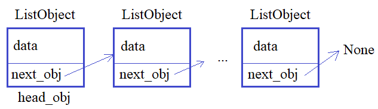

**Подвиг 2.** (task_1.py)

 Объявите класс Money так, чтобы объекты этого класса можно было создавать следующим образом:

```
my_money = Money(100)
your_money = Money(1000)
```

Здесь при создании объектов указывается количество денег, которое должно сохраняться в локальном свойстве (атрибуте) money каждого экземпляра класса.

P.S. На экран в программе ничего выводить не нужно.

---

**Подвиг 3.** (task_2.py)

 Объявите класс Point так, чтобы объекты этого класса можно было создавать командами:

```
p1 = Point(10, 20)
p2 = Point(12, 5, 'red')
```

Здесь первые два значения - это координаты точки на плоскости (локальные свойства x, y), а третий необязательный аргумент - цвет точки (локальное свойство **color**). Если цвет не указывается, то он по умолчанию принимает значение black.

Создайте тысячу таких объектов с координатами (1, 1), (3, 3), (5, 5), ... то есть, с увеличением на два для каждой новой точки. Каждый объект следует поместить в список **points** (по порядку). Для второго объекта в списке points укажите цвет 'yellow'.

P.S. На экран в программе ничего выводить не нужно.

---

**Подвиг 4.** (task_3.py)

Объявите три класса геометрических фигур: Line, Rect, Ellipse. Должна быть возможность создавать объекты каждого класса следующими командами:

```
g1 = Line(a, b, c, d)
g2 = Rect(a, b, c, d)
g3 = Ellipse(a, b, c, d)
```

Здесь в качестве аргументов a, b, c, d передаются координаты верхнего правого и нижнего левого углов (произвольные числа). В каждом объекте координаты должны сохраняться в локальных свойствах sp (верхний правый угол) и ep (нижний левый) в виде кортежей (a, b) и (c, d) соответственно.

Сформируйте 217 объектов этих классов: для каждого текущего объекта класс выбирается случайно (или Line, или Rect, или Ellipse). Координаты также генерируются случайным образом (числовые значения). Все объекты сохраните в списке elements.

В списке elements обнулите координаты объектов только для класса Line.

P.S. На экран в программе ничего выводить не нужно.

---

**Подвиг 5.** (task_4.py)

Объявите класс TriangleChecker, объекты которого можно было бы создавать командой:

```
tr = TriangleChecker(a, b, c)
```

Здесь a, b, c - длины сторон треугольника.

В классе TriangleChecker необходимо объявить метод is_triangle(), который бы возвращал следующие коды:

1 - если хотя бы одна сторона не число (не float или int) или хотя бы одно число меньше или равно нулю;\
2 - указанные числа a, b, c не могут являться длинами сторон треугольника;\
3 - стороны a, b, c образуют треугольник.

Проверку параметров a, b, c проводить именно в таком порядке.

Прочитайте из входного потока строку, содержащую три числа, разделенных пробелами, командой:

```
a, b, c = map(int, input().split())
```

Затем, создайте объект tr класса TriangleChecker и передайте ему прочитанные значения a, b, c. Вызовите метод is_triangle() из объекта tr и выведите результат на экран (код, который она вернет).

**Sample Input:**

    3 4 5

**Sample Output:**

    3

---

**Подвиг 6.** (task_5.py)

 Объявите класс Graph, объекты которого можно было бы создавать с помощью команды:

```
gr_1 = Graph(data)
```

где data - список из числовых данных (данные для графика). При создании каждого экземпляра класса должны формироваться следующие локальные свойства:

<u>data</u> - ссылка на список из числовых данных (у каждого объекта должен быть свой список с данными, нужно создавать копию переданного списка);
<u>is_show</u> - булево значение (True/False) для показа (True) и сокрытия (False) данных графика (по умолчанию True);

В этом классе объявите следующие методы:

<u>set_data(self, data)</u> - для передачи нового списка данных в текущий график;\
<u>show_table(self)</u> - для отображения данных в виде строки из списка чисел (числа следуют через пробел);\
<u>show_graph(self)</u> - для отображения данных в виде графика (метод выводит в консоль сообщение: "Графическое отображение данных: <строка из чисел следующих через пробел>");\
<u>show_bar(self)</u> - для отображения данных в виде столбчатой диаграммы (метод выводит в консоль сообщение: "Столбчатая диаграмма: <строка из чисел следующих через пробел>");\
<u>set_show(self, fl_show)</u> - метод для изменения локального свойства is_show на переданное значение fl_show.

Если локальное свойство is_show равно False, то методы show_table(), show_graph() и show_bar() должны выводить сообщение:

"Отображение данных закрыто"

Прочитайте из входного потока числовые данные с помощью команды:

```
data_graph = list(map(int, input().split()))
```

Создайте объект gr класса Graph с набором прочитанных данных, вызовите метод show_bar(), затем метод set_show() со значением fl_show = False и вызовите метод show_table(). На экране должны отобразиться две соответствующие строки.

Sample Input:

    8 11 10 -32 0 7 18

Sample Output:

    Столбчатая диаграмма: 8 11 10 -32 0 7 18
    Отображение данных закрыто

---
**Подвиг 7.** (task_6.py)

 Объявите в программе следующие несколько классов:

<u>CPU</u> - класс для описания процессоров;\
<u>Memory</u> - класс для описания памяти;\
<u>MotherBoard</u> - класс для описания материнских плат.

Обеспечить возможность создания объектов каждого класса командами:

```
cpu = CPU(наименование, тактовая частота)
mem = Memory(наименование, размер памяти)
mb = MotherBoard(наименование, процессор, память1, память2, ..., памятьN)
```

Обратите внимание при создании объекта класса MotherBoard можно передавать несколько объектов класса Memory, максимум N - по числу слотов памяти на материнской плате (N = 4).

Объекты классов должны иметь следующие локальные свойства:

для класса CPU: name - наименование; fr - тактовая частота;\
для класса Memory: name - наименование; volume - объем памяти;\
для класса MotherBoard: name - наименование; cpu - ссылка на объект класса CPU; total_mem_slots = 4 - общее число слотов памяти (атрибут прописывается с этим значением и не меняется); mem_slots - список из объектов класса Memory (максимум total_mem_slots = 4 штук по максимальному числу слотов памяти).

Класс MotherBoard должен иметь метод get_config(self) для возвращения текущей конфигурации компонентов на материнской плате в виде следующего списка из четырех строк:

```
['Материнская плата: <наименование>',
'Центральный процессор: <наименование>, <тактовая частота>',
'Слотов памяти: <общее число слотов памяти>',
'Память: <наименование_1> - <объем_1>; <наименование_2> - <объем_2>; ...; <наименование_N> - <объем_N>']
```

Создайте объект **mb** класса MotherBoard с одним CPU (объект класса CPU) и двумя слотами памяти (объекты класса Memory).

P.S. Отображать на экране ничего не нужно, только создать объект по указанным требованиям.

---

**Подвиг 8.** (task_7.py)

 Объявите в программе класс Cart (корзина), объекты которого создаются командой:

```
cart = Cart()
```

Каждый объект класса Cart должен иметь локальное свойство goods - список объектов для покупки (объекты классов Table, TV, Notebook и Cup). Изначально этот список должен быть пустым.

В классе Cart объявить методы:

<u>add(self, gd)</u> - добавление в корзину товара, представленного объектом gd;\
<u>remove(self, indx)</u> - удаление из корзины товара по индексу indx;\
<u>get_list(self)</u> - получение из корзины товаров в виде списка из строк:

    ['<наименовние_1>: <цена_1>',
    '<наименовние_2>: <цена_2>',
    ...
    '<наименовние_N>: <цена_N>']

Объявите в программе следующие классы для описания товаров:

*Table* - столы;\
*TV* - телевизоры;\
*Notebook* - ноутбуки;\
*Cup* - кружки.\

Объекты этих классов должны создаваться командой:

    gd = ИмяКласса(name, price)

Каждый объект классов товаров должен содержать локальные свойства:

<u>name</u> - наименование;\
<u>price</u> - цена.

Создайте в программе объект *cart* класса Cart. Добавьте в него два телевизора (TV), один стол (Table), два ноутбука (Notebook) и одну кружку (Cup). Названия и цены придумайте сами.

P.S. Отображать на экране ничего не нужно, только создать объекты по указанным требованиям.

---

**Подвиг 9.** (task_8.py)

 Вам необходимо реализовать односвязный список (**не список языка Python, объекты в списке не хранить, а формировать связанную структуру, показанную на рисунке**) из объектов класса ListObject:

 

Для этого объявите в программе класс ListObject, объекты которого создаются командой:

    obj = ListObject(data)

Каждый объект класса ListObject должен содержать локальные свойства:

<u>next_obj</u> - ссылка на следующий присоединенный объект (если следующего объекта нет, то next_obj = None);\
<u>data</u> - данные объекта в виде строки.

В самом классе ListObject должен быть объявлен метод:

<u>link(self, obj)</u> - для присоединения объекта obj такого же класса к текущему объекту self (то есть, атрибут next_obj объекта self должен ссылаться на obj).

Прочитайте список строк из входного потока командой:

    lst_in = list(map(str.strip, sys.stdin.readlines()))

Затем сформируйте односвязный список, в объектах которых (в атрибуте data) хранятся строки из списка lst_in (первая строка в первом объекте, вторая - во втором и  т.д.). На первый добавленный объект класса ListObject должна ссылаться переменная head_obj.

P.S. В программе что-либо выводить на экран не нужно.

Sample Input:
```
1. Первые шаги в ООП
1.1 Как правильно проходить этот курс
1.2 Концепция ООП простыми словами
1.3 Классы и объекты. Атрибуты классов и объектов
1.4 Методы классов. Параметр self
1.5 Инициализатор init и финализатор del
1.6 Магический метод new. Пример паттерна Singleton
1.7 Методы класса (classmethod) и статические методы (staticmethod)
```
Sample Output:

---

**Большой подвиг 10.** (task_9.py)

 Объявите два класса:

<u>Cell</u> - для представления клетки игрового поля;
<u>GamePole</u> - для управления игровым полем, размером N x N клеток.

С помощью класса Cell предполагается создавать отдельные клетки командой:

    c1 = Cell(around_mines, mine)

Здесь <u>around_mines</u> - число мин вокруг данной клетки поля; mine - булева величина (True/False), означающая наличие мины в текущей клетке. При этом, в каждом объекте класса Cell должны создаваться локальные свойства:

<u>around_mines</u> - число мин вокруг клетки (начальное значение 0);
<u>mine</u> - наличие мины в текущей клетке (True/False);
<u>fl_open</u> - открыта/закрыта клетка - булево значение (True/False). Изначально все клетки закрыты (False).


С помощью класса GamePole должна быть возможность создавать квадратное игровое поле с числом клеток N x N:

    pole_game = GamePole(N, M)

Здесь N - размер поля; M - общее число мин на поле. При этом, каждая клетка представляется объектом класса Cell и все объекты хранятся в двумерном списке N x N элементов - локальном свойстве pole объекта класса GamePole.

В классе GamePole должны быть также реализованы следующие методы:

<u>init()</u> - инициализация поля с новой расстановкой M мин (случайным образом по игровому полю, разумеется каждая мина должна находиться в отдельной клетке).\
<u>show()</u> - отображение поля в консоли в виде таблицы чисел открытых клеток (если клетка не открыта, то отображается символ #).

При создании экземпляра класса GamePole в его инициализаторе следует вызывать метод init() для первоначальной инициализации игрового поля.

В классе GamePole могут быть и другие вспомогательные методы.

Создайте экземпляр **pole_game** класса GamePole с размером поля N = 10 и числом мин M = 12.

P.S. На экран в программе ничего выводить не нужно.
