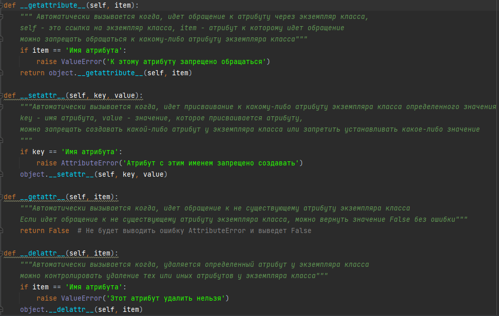
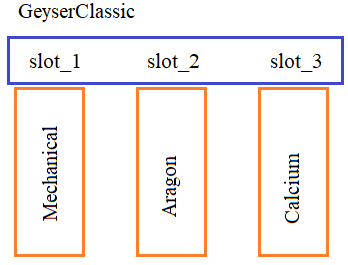

## Магические методы для атрибутов

- \_\_setattr__(self, key, value) - автоматически вызывается при изменении свойства класса
- \_\_getattribute__(self, item) - автоматически вызывается при получении свойства класса с именем *item*
- \_\_getattr__(self, item) - автоматически вызывается при получении несуществующего свойства *item* класса
-\_\_delattr__(self, item) - автоматически вызывается при удалении свойства *item* (**<u>не важно:</u>** существует оно или нет)
<br/><br/>


---
**Подвиг 3.** (task_1.py)

 Объявите класс Book для представления информации о книге. Объекты этого класса должны создаваться командами:

    book = Book()
    book = Book(название, автор, число страниц, год издания)

В каждом объекте класса Book автоматически должны формироваться следующие локальные свойства:

title - заголовок книги (строка, по умолчанию пустая строка);\
author - автор книги (строка, по умолчанию пустая строка);\
pages - число страниц (целое число, по умолчанию 0);\
year - год издания (целое число, по умолчанию 0).

Объявите в классе Book магический метод __setattr__ для проверки типов присваиваемых данных локальным свойствам title, author, pages и year. Если типы не соответствуют локальному атрибуту (например, title должна ссылаться на строку, а pages - на целое число), то генерировать исключение командой:

    raise TypeError("Неверный тип присваиваемых данных.")

Создайте в программе объект book класса Book для книги:

    автор: Сергей Балакирев
    заголовок: Python ООП
    pages: 123
    year: 2022

P.S. На экран ничего выводить не нужно.

---

**Подвиг 4.** (task_2.py)

 Вы создаете интернет-магазин. Для этого нужно объявить два класса:

<u>Shop</u> - класс для управления магазином в целом;\
<u>Product</u> - класс для представления отдельного товара.

Объекты класса Shop следует создавать командой:

    shop = Shop(название магазина)

В каждом объекте класса Shop должно создаваться локальное свойство:

goods - список товаров (изначально список пустой).

А также в классе объявить методы:

<u>add_product(self, product)</u> - добавление нового товара в магазин (в конец списка goods);\
<u>remove_product(self, product)</u> - удаление товара product из магазина (из списка goods);

Объекты класса Product следует создавать командой:

p = Product(название, вес, цена)

В них автоматически должны формироваться локальные атрибуты:

id - уникальный идентификационный номер товара (генерируется автоматически как целое положительное число от 1 и далее);\
name - название товара (строка);\
weight - вес товара (целое или вещественное положительное число);\
price - цена (целое или вещественное положительное число).

В классе Product через магические методы (подумайте какие) осуществить проверку на тип присваиваемых данных локальным атрибутам объектов класса (например, id - целое число, name - строка и т.п.). Если проверка не проходит, то генерировать исключение командой:

    raise TypeError("Неверный тип присваиваемых данных.")

Также в классе Product с помощью магического(их) метода(ов) запретить удаление локального атрибута id. При попытке это сделать генерировать исключение:

    raise AttributeError("Атрибут id удалять запрещено.")

Пример использования классов (в программе эти строчки не писать):

```python
shop = Shop("Балакирев и К")
book = Product("Python ООП", 100, 1024)
shop.add_product(book)
shop.add_product(Product("Python", 150, 512))
for p in shop.goods:
    print(f"{p.name}, {p.weight}, {p.price}")
```
P.S. На экран ничего выводить не нужно.

---

**Подвиг 5.** (task_3.py)

 Необходимо создать программу для обучающего курса. Для этого объявляются три класса:

<u>Course</u> - класс, отвечающий за управление курсом в целом;\
<u>Module</u> - класс, описывающий один модуль (раздел) курса;\
<u>LessonItem</u> - класс одного занятия (урока).

Структура курса на уровне этих классов, приведена на рисунке ниже:


Объекты класса LessonItem должны создаваться командой:

    lesson = LessonItem(название урока, число практических занятий, общая длительность урока)

Соответственно, в каждом объекте класса LessonItem должны создаваться локальные атрибуты:

title - название урока (строка);\
practices - число практических занятий (целое положительное число);\
duration - общая длительность урока (целое положительное число).

Необходимо с помощью магических методов реализовать следующую логику взаимодействия с объектами класса LessonItem:

1. Проверять тип присваиваемых данных локальным атрибутам. Если типы не соответствуют требованиям, то генерировать исключение командой:
```python
raise TypeError("Неверный тип присваиваемых данных.")
```
2. При обращении к несуществующим атрибутам объектов класса LessonItem возвращать значение False.
3. Запретить удаление атрибутов title, practices и duration в объектах класса LessonItem.

Объекты класса Module должны создаваться командой:

    module = Module(название модуля)

Каждый объект класса Module должен содержать локальные атрибуты:

name - название модуля;\
lessons - список из уроков (объектов класса LessonItem), входящих в модуль (изначально список пуст).

Также в классе Module должны быть реализованы методы:

<u>add_lesson(self, lesson)</u> - добавление в модуль (в конец списка lessons) нового урока (объекта класса LessonItem);\
<u>remove_lesson(self, indx)</u> - удаление урока по индексу в списке lessons.

Наконец, объекты класса Course создаются командой:

    course = Course(название курса)

И содержат следующие локальные атрибуты:

name - название курса (строка);\
modules - список модулей в курсе (изначально список пуст).

Также в классе Course должны присутствовать следующие методы:

<u>add_module(self, module)</u> - добавление нового модуля в конце списка modules;
<u>remove_module(self, indx)</u> - удаление модуля из списка modules по индексу в этом списке.

Пример использования классов (в программе эти строчки не писать):

```python
course = Course("Python ООП")
module_1 = Module("Часть первая")
module_1.add_lesson(LessonItem("Урок 1", 7, 1000))
module_1.add_lesson(LessonItem("Урок 2", 10, 1200))
module_1.add_lesson(LessonItem("Урок 3", 5, 800))
course.add_module(module_1)
module_2 = Module("Часть вторая")
module_2.add_lesson(LessonItem("Урок 1", 7, 1000))
module_2.add_lesson(LessonItem("Урок 2", 10, 1200))
course.add_module(module_2)
```
P.S. На экран ничего выводить не нужно.

---

**Подвиг 6.** (task_4.py)

 Вам необходимо написать программу описания музеев. Для этого нужно объявить класс Museum, объекты которого формируются командой:

    mus = Museum(название музея)

В объектах этого класса должны формироваться следующие локальные атрибуты:

name - название музея (строка);\
exhibits - список экспонатов (изначально пустой список).

Сам класс Museum должен иметь методы:

<u>add_exhibit(self, obj)</u> - добавление нового экспоната в музей (в конец списка exhibits);\
<u>remove_exhibit(self, obj)</u> - удаление экспоната из музея (из списка exhibits по ссылке obj - на экспонат)\
<u>get_info_exhibit(self, indx)</u> - получение информации об экспонате (строка) по индексу списка (нумерация с нуля).

Экспонаты представляются объектами своих классов. Для примера объявите в программе следующие классы экспонатов:

- Picture - для картин;
- Mummies - для мумий;
- Papyri - для папирусов.

Объекты этих классов должны создаваться следующим образом (с соответствующим набором локальных атрибутов):

```python
p = Picture('название', 'художник', 'описание')            # локальные атрибуты: name - название; author - художник; descr - описание
m = Mummies('имя мумии', 'место находки', 'описание')      # локальные атрибуты: name - имя мумии; location - место находки; descr - описание
pr = Papyri('название папируса', 'датировка', 'описание')  # локальные атрибуты: name - название папируса; date - датировка (строка); descr - описание
```
Метод get_info_exhibit() класса Museum должен возвращать значение атрибута descr указанного экспоната в формате:

    "Описание экспоната {name}: {descr}"

Например:

    "Описание экспоната Девятый вал: Айвазовский написал супер картину."

Пример использования классов (в программе эти строчки писать не нужно - только для примера):

```python
mus = Museum("Эрмитаж")
mus.add_exhibit(Picture("Балакирев с подписчиками пишет письмо иноземному султану", "Неизвестный автор", "Вдохновляющая, устрашающая, волнующая картина"))
mus.add_exhibit(Mummies("Балакирев", "Древняя Россия", "Просветитель XXI века, удостоенный мумификации"))
p = Papyri("Ученья для, не злата ради", "Древняя Россия", "Самое древнее найденное рукописное свидетельство о языках программирования")
mus.add_exhibit(p)
for x in mus.exhibits:
    print(x.descr)
```
P.S. На экран ничего выводить не нужно.

---

**Подвиг 7 (на повторение).** (task_5.py)

 Объявите класс SmartPhone, объекты которого предполагается создавать командой:

    sm = SmartPhone(марка смартфона)

Каждый объект должен содержать локальные атрибуты:

model - марка смартфона (строка);\
apps - список из установленных приложений (изначально пустой).

Также в классе SmartPhone должны быть объявлены следующие методы:

<u>add_app(self, app)</u> - добавление нового приложения на смартфон (в конец списка apps);\
<u>remove_app(self, app)</u> - удаление приложения по ссылке на объект app.

При добавлении нового приложения проверять, что оно отсутствует в списке apps (отсутствует объект соответствующего класса).

Каждое приложение должно определяться своим классом. Для примера объявите следующие классы:

<u>AppVK</u> - класс приложения ВКонтаке;\
<u>AppYouTube</u> - класс приложения YouTube;\
<u>AppPhone</u> - класс приложения телефона.

Объекты этих классов должны создаваться следующим образом (с соответствующим набором локальных атрибутов):

```python
app_1 = AppVK() # name = "ВКонтакте"
app_2 = AppYouTube(1024) # name = "YouTube", memory_max = 1024
app_3 = AppPhone({"Балакирев": 1234567890, "Сергей": 98450647365, "Работа": 112}) # name = "Phone", phone_list = словарь с контактами
```
Пример использования классов (в программе эти строчки не писать):

```python
sm = SmartPhone("Honor 1.0")
sm.add_app(AppVK())
sm.add_app(AppVK())  # второй раз добавляться не должно
sm.add_app(AppYouTube(2048))
for a in sm.apps:
    print(a.name)
```
P.S. На экран ничего выводить не нужно.

---

**Подвиг 8.** (task_6.py)

 Объявите класс Circle (окружность), объекты которого должны создаваться командой:
```python
circle = Circle(x, y, radius)   # x, y - координаты центра окружности; radius - радиус окружности
```
В каждом объекте класса Circle должны формироваться локальные приватные атрибуты:

__x, __y - координаты центра окружности (вещественные или целые числа);\
__radius - радиус окружности (вещественное или целое положительное число).

Для доступа к этим приватным атрибутам в классе Circle следует объявить объекты-свойства (property):

x, y - для изменения и доступа к значениям __x, __y, соответственно;\
radius - для изменения и доступа к значению __radius.

При изменении значений приватных атрибутов через объекты-свойства нужно проверять, что присваиваемые значения - числа (целые или вещественные). Дополнительно у радиуса проверять, что число должно быть положительным (строго больше нуля). Сделать все эти проверки нужно через магические методы. При некорректных переданных числовых значениях, прежние значения меняться не должны (исключений никаких генерировать при этом не нужно).

Если присваиваемое значение не числовое, то генерировать исключение командой:

    raise TypeError("Неверный тип присваиваемых данных.")

При обращении к несуществующему атрибуту объектов класса Circle выдавать булево значение False.

Пример использования класса (эти строчки в программе писать не нужно):

```python
circle = Circle(10.5, 7, 22)
circle.radius = -10 # прежнее значение не должно меняться, т.к. отрицательный радиус недопустим
x, y = circle.x, circle.y
res = circle.name # False, т.к. атрибут name не существует
```
P.S. На экран ничего выводить не нужно.

---

**Подвиг 9.** (task_7.py)

Объявите в программе класс Dimensions (габариты) с атрибутами:

    MIN_DIMENSION = 10
    MAX_DIMENSION = 1000

Каждый объект класса Dimensions должен создаваться командой:

    d3 = Dimensions(a, b, c)   # a, b, c - габаритные размеры

и содержать локальные атрибуты:

__a, __b, __c - габаритные размеры (целые или вещественные числа).

Для работы с этими локальными атрибутами в классе Dimensions следует прописать следующие объекты-свойства:

a, b, c - для изменения и считывания соответствующих локальных атрибутов __a, __b, __c.

При изменении значений __a, __b, __c следует проверять, что присваиваемое значение число в диапазоне [MIN_DIMENSION; MAX_DIMENSION]. Если это не так, то новое значение не присваивается (игнорируется).

С помощью магических методов данного занятия запретить создание локальных атрибутов MIN_DIMENSION и MAX_DIMENSION в объектах класса Dimensions. При попытке это сделать генерировать исключение:

    raise AttributeError("Менять атрибуты MIN_DIMENSION и MAX_DIMENSION запрещено.")

Пример использования класса  (эти строчки в программе писать не нужно):

```code
d = Dimensions(10.5, 20.1, 30)
d.a = 8
d.b = 15
a, b, c = d.a, d.b, d.c  # a=10.5, b=15, c=30
d.MAX_DIMENSION = 10  # исключение AttributeError
```
P.S. В программе нужно объявить только класс Dimensions. На экран ничего выводить не нужно.

---

**Подвиг 10.** (task_8.py)

Объявите класс GeyserClassic - фильтр для очистки воды. В этом классе должно быть три слота для фильтров. Каждый слот строго для своего класса фильтра:

<u>Mechanical</u> - для очистки от крупных механических частиц;\
<u>Aragon</u> - для последующей очистки воды;\
<u>Calcium</u> - для обработки воды на третьем этапе.



Объекты классов фильтров должны создаваться командами:

```python
filter_1 = Mechanical(дата установки)
filter_2 = Aragon(дата установки)
filter_3 = Calcium(дата установки)
```
Во всех объектах этих классов должен формироваться локальный атрибут:

date - дата установки фильтров (для простоты - положительное вещественное число).

Также нужно запретить изменение этого атрибута после создания объектов этих классов (только чтение). В случае присвоения нового значения, прежнее значение не менять. Ошибок никаких не генерировать.

Объекты класса GeyserClassic должны создаваться командой:

    g = GeyserClassic()

А сам класс иметь атрибут:

MAX_DATE_FILTER = 100 - максимальное время работы фильтра (любого)

и следующие методы:

<u>add_filter(self, slot_num, filter)</u> - добавление фильтра filter в указанный слот slot_num (номер слота: 1, 2 и 3), если он (слот) пустой (без фильтра). Также здесь следует проверять, что в первый слот можно установить только объекты класса Mechanical, во второй - объекты класса Aragon и в третий - объекты класса Calcium. Иначе слот должен оставаться пустым.

<u>remove_filter(self, slot_num)</u> - извлечение фильтра из указанного слота (slot_num: 1, 2, и 3);

<u>get_filters(self)</u> - возвращает кортеж из набора трех фильтров в порядке их установки (по возрастанию номеров слотов);

<u>water_on(self)</u> - включение воды: возвращает True, если вода течет и False - в противном случае.

Метод water_on() должен возвращать значение True при выполнении следующих условий:

- все три фильтра установлены в слотах;
- все фильтры работают в пределах срока службы (значение (time.time() - date) должно быть в пределах [0; MAX_DATE_FILTER])

Пример использования классов  (эти строчки в программе писать не нужно):

```python
my_water = GeyserClassic()
my_water.add_filter(1, Mechanical(time.time()))
my_water.add_filter(2, Aragon(time.time()))
w = my_water.water_on() # False
my_water.add_filter(3, Calcium(time.time()))
w = my_water.water_on() # True
f1, f2, f3 = my_water.get_filters()  # f1, f2, f3 - ссылки на соответствующие объекты классов фильтров
my_water.add_filter(3, Calcium(time.time())) # повторное добавление в занятый слот невозможно
my_water.add_filter(2, Calcium(time.time())) # добавление в "чужой" слот также невозможно
```
P.S. На экран ничего выводить не нужно.
