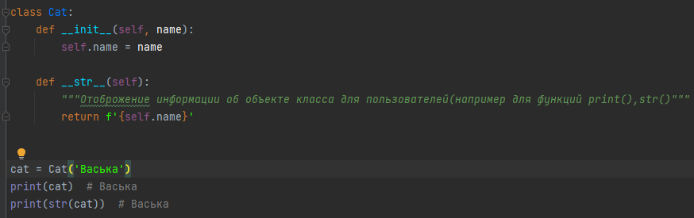
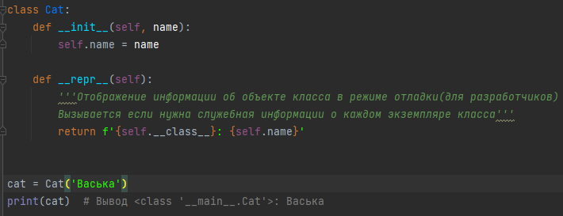
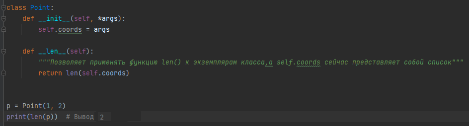
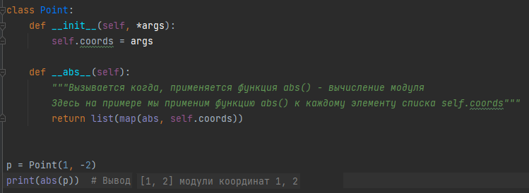
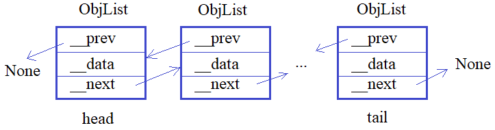
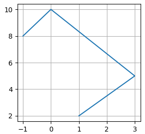

## Методы __str__, __repr__, __len__, __abs__









---


**Подвиг 2.** (task_1.py)

Объявите класс с именем Book (книга), объекты которого создаются командой:

    book = Book(title, author, pages)

где <u>title</u> - название книги (строка); \
<u>author</u> - автор книги (строка); \
<u>pages</u> - число страниц в книге (целое число).

Также при выводе информации об объекте на экран командой:

    print(book)

должна отображаться строчка в формате:

    "Книга: {title}; {author}; {pages}"

Например:

    "Книга: Муму; Тургенев; 123"

Прочитайте из входного потока строки с информацией по книге командой:

```python
lst_in = list(map(str.strip, sys.stdin.readlines()))
```
(строки идут в порядке: title, author, pages). Создайте объект класса Book и выведите его строковое представление в консоль.

**Sample Input:**

    Python ООП
    Балакирев С.М.
    1024

**Sample Output:**

    Книга: Python ООП; Балакирев С.М.; 1024

---


**Подвиг 3.** (task_2.py)

Объявите класс с именем Model, объекты которого создаются командой:

    model = Model()

Объявите в этом классе метод query() для формирования записи базы данных. Использоваться этот метод должен следующим образом:

    model.query(field_1=value_1, field_2=value_2, ..., field_N=value_N)

Например:

    model.query(id=1, fio='Sergey', old=33)

Все эти переданные данные должны сохраняться внутри объекта model класса Model. Затем, при выполнении команды:

    print(model)

В консоль должна выводиться информация об объекте в формате:

"Model: field_1 = value_1, field_2 = value_2, ..., field_N = value_N"

Например:

"Model: id = 1, fio = Sergey, old = 33"

Если метод query() не вызывался, то в консоль выводится строка:

"Model"

P.S. В программе нужно только объявить класс, выводить в консоль ничего не нужно.

---

**Подвиг 4.** (task_3.py)

Объявите класс WordString, объекты которого создаются командами:
```python
w1 = WordString()
w2 = WordString(string)
```
где <u>string</u> - передаваемая строка. Например:
```python
words = WordString("Курс по Python ООП")
```
Реализовать следующий функционал для объектов этого класса:

<u>len(words)</u> - должно возвращаться число слов в переданной строке (слова разделяются одним или несколькими пробелами);\
<u>words(indx)</u> - должно возвращаться слово по его индексу (indx - порядковый номер слова в строке, начиная с 0).

Также в классе WordString реализовать объект-свойство (property):

<u>string</u> - для передачи и считывания строки.

Пример пользования классом WordString (эти строчки в программе писать не нужно):
```python
words = WordString()
words.string = "Курс по Python ООП"
n = len(words)
first = "" if n == 0 else words(0)
print(words.string)
print(f"Число слов: {n}; первое слово: {first}")
```
P.S. В программе нужно только объявить класс, выводить в консоль ничего не нужно.

---

**Подвиг 5.** (task_4.py)

Объявите класс LinkedList (связный список) для работы со следующей структурой данных:



Здесь создается список из связанных между собой объектов класса ObjList. Объекты этого класса создаются командой:

    obj = ObjList(data)

где data - строка с некоторой информацией. Также в каждом объекте obj класса ObjList должны создаваться следующие локальные атрибуты:

*__data* - ссылка на строку с данными;\
*__prev* - ссылка на предыдущий объект связного списка (если объекта нет, то __prev = None);\
*__next* - ссылка на следующий объект связного списка (если объекта нет, то __next = None).

В свою очередь, объекты класса LinkedList должны создаваться командой:

    linked_lst = LinkedList()

и содержать локальные атрибуты:

head - ссылка на первый объект связного списка (если список пуст, то head = None);\
tail - ссылка на последний объект связного списка (если список пуст, то tail = None).

А сам класс содержать следующие методы:

<u>add_obj(obj)</u> - добавление нового объекта obj класса ObjList в конец связного списка;\
<u>remove_obj(indx)</u> - удаление объекта класса ObjList из связного списка по его порядковому номеру (индексу); индекс отсчитывается с нуля.

Также с объектами класса LinkedList должны поддерживаться следующие операции:

*len(linked_lst)* - возвращает число объектов в связном списке;\
*linked_lst(indx)* - возвращает строку __data, хранящуюся в объекте класса ObjList, расположенного под индексом indx (в связном списке).

Пример использования классов (эти строчки в программе писать не нужно):
```python
linked_lst = LinkedList()
linked_lst.add_obj(ObjList("Sergey"))
linked_lst.add_obj(ObjList("Balakirev"))
linked_lst.add_obj(ObjList("Python"))
linked_lst.remove_obj(2)
linked_lst.add_obj(ObjList("Python ООП"))
n = len(linked_lst)  # n = 3
s = linked_lst(1) # s = Balakirev
```
P.S. На экран в программе ничего выводить не нужно.

---

**Подвиг 6.** (task_5.py)

 Объявите класс с именем Complex для представления и работы с комплексными числами. Объекты этого класса должны создаваться командой:

    cm = Complex(real, img)

где <u>real</u> - действительная часть комплексного числа (целое или вещественное значение); <u>img</u> - мнимая часть комплексного числа (целое или вещественное значение).

Объявите в этом классе следующие объекты-свойства (property):

real - для записи и считывания действительного значения;\
img - для записи и считывания мнимого значения.

При записи новых значений необходимо проверять тип передаваемых данных. Если тип не соответствует целому или вещественному числу, то генерировать исключение командой:

    raise ValueError("Неверный тип данных.")

Также с объектами класса Complex должна поддерживаться функция:

    res = abs(cm)

возвращающая модуль комплексного числа (вычисляется по формуле: sqrt(real*real + img*img) - корень квадратный от суммы квадратов действительной и мнимой частей комплексного числа).

Создайте объект **cmp** класса Complex для комплексного числа с real = 7 и img = 8. Затем, через объекты-свойства real и img измените эти значения на real = 3 и img = 4. Вычислите модуль полученного комплексного числа (сохраните результат в переменной **c_abs**).

P.S. На экран ничего выводить не нужно.

---

**Подвиг 7.** (task_6.py)

Объявите класс с именем RadiusVector для описания и работы с n-мерным вектором (у которого n координат). Объекты этого класса должны создаваться командами:
```python
# создание 5-мерного радиус-вектора с нулевыми значениями координат (аргумент - целое число больше 1)
vector = RadiusVector(5)  # координаты: 0, 0, 0, 0, 0

# создание 4-мерного радиус-вектора с координатами: 1, -5, 3.4, 10 (координаты - любые целые или вещественные числа)
vector = RadiusVector(1, -5, 3.4, 10)
```
То есть, при передаче одного значения, оно интерпретируется, как размерность нулевого радиус-вектора. Если же передается более одного числового аргумента, то они интерпретируются, как координаты радиус-вектора.

Класс RadiusVector должен содержать методы:

*set_coords(coord_1, coord_2, ..., coord_N)* - для изменения координат радиус-вектора;\
*get_coords()* - для получения текущих координат радиус-вектора (в виде кортежа).

Также с объектами класса RadiusVector должны поддерживаться следующие функции:

*len(vector)* - возвращает число координат радиус-вектора (его размерность);\
*abs(vector)* - возвращает длину радиус-вектора (вычисляется как: sqrt(coord_1*coord_1 + coord_2*coord_2 + ... + coord_N*coord_N) - корень квадратный из суммы квадратов координат).

Пример использования класса RadiusVector (эти строчки в программе писать не нужно):

```python
vector3D = RadiusVector(3)
vector3D.set_coords(3, -5.6, 8)
a, b, c = vector3D.get_coords()
vector3D.set_coords(3, -5.6, 8, 10, 11) # ошибки быть не должно, последние две координаты игнорируются
vector3D.set_coords(1, 2) # ошибки быть не должно, меняются только первые две координаты
res_len = len(vector3D) # res_len = 3
res_abs = abs(vector3D)
```
P.S. На экран ничего выводить не нужно, только объявить класс RadiusVector.

---

**Подвиг 8.** (task_7.py)

Объявите класс *DeltaClock* для вычисления разницы времен. Объекты этого класса должны создаваться командой:

    dt = DeltaClock(clock1, clock2)

где clock1, clock2 - объекты другого класса Clock для хранения текущего времени. Эти объекты должны создаваться командой:

    clock = Clock(hours, minutes, seconds)

где *hours, minutes, seconds* - часы, минуты, секунды (целые неотрицательные числа).

В классе Clock также должен быть (по крайней мере) один метод (возможны и другие):

get_time() - возвращает текущее время в секундах (то есть, значение hours * 3600 + minutes * 60 + seconds).

После создания объекта dt класса DeltaClock, с ним должны выполняться команды:
```python
str_dt = str(dt)   # возвращает строку разницы времен clock1 - clock2 в формате: часы: минуты: секунды
len_dt = len(dt)   # разницу времен clock1 - clock2 в секундах (целое число)
print(dt)   # отображает строку разницы времен clock1 - clock2 в формате: часы: минуты: секунды
```
Если разность получается отрицательной, то разницу времен считать нулевой.

Пример использования классов (эти строчки в программе писать не нужно):
```python
dt = DeltaClock(Clock(2, 45, 0), Clock(1, 15, 0))
print(dt) # 01: 30: 00
len_dt = len(dt) # 5400
```
Обратите внимание, добавляется незначащий ноль, если число меньше 10.

P.S. На экран ничего выводить не нужно, только объявить классы.

---

**Подвиг 9.** (task_8.py)

Объявите класс *Recipe* для представления рецептов. Отдельные ингредиенты рецепта должны определяться классом Ingredient. Объекты этих классов должны создаваться командами:
```python
ing = Ingredient(name, volume, measure)
recipe = Recipe()
recipe = Recipe(ing_1, ing_2,..., ing_N)
```
где ing_1, ing_2,..., ing_N - объекты класса Ingredient.

В каждом объекте класса Ingredient должны создаваться локальные атрибуты:

name - название ингредиента (строка);\
volume - объем ингредиента в рецепте (вещественное число);\
measure - единица измерения объема ингредиента (строка), например, литр, чайная ложка, грамм, штук и т.д.;

С объектами класса Ingredient должна работать функция:

    str(ing)  # название: объем, ед. изм.

и возвращать строковое представление объекта в формате:

"название: объем, ед. изм."

Например:
```python
ing = Ingredient("Соль", 1, "столовая ложка")
s = str(ing) # Соль: 1, столовая ложка
```
Класс Recipe должен иметь следующие методы:

<u>add_ingredient(ing)</u> - добавление нового ингредиента ing (объект класса Ingredient) в рецепт (в конец);\
<u>remove_ingredient(ing)</u> - удаление ингредиента по объекту ing (объект класса Ingredient) из рецепта;\
<u>get_ingredients()</u> - получение кортежа из объектов класса Ingredient текущего рецепта.

Также с объектами класса Recipe должна поддерживаться функция:

<u>len(recipe)</u> - возвращает число ингредиентов в рецепте.

Пример использования классов (эти строчки в программе писать не нужно):
```python
recipe = Recipe()
recipe.add_ingredient(Ingredient("Соль", 1, "столовая ложка"))
recipe.add_ingredient(Ingredient("Мука", 1, "кг"))
recipe.add_ingredient(Ingredient("Мясо баранины", 10, "кг"))
ings = recipe.get_ingredients()
n = len(recipe) # n = 3
```
P.S. На экран ничего выводить не нужно, только объявить классы.

---


**Подвиг 10 (на повторение).** (task_9.py)

Объявите класс *PolyLine* (полилиния) для представления линии из последовательности прямолинейных сегментов. Объекты этого класса должны создаваться командой:

    poly = PolyLine(start_coord, coord_2, coord_3, ..., coord_N)

Здесь start_coord - координата начала полилинии (кортеж из двух чисел x, y); coord_2, coord_3, ... - последующие координаты точек на плоскости (представленные кортежами), соединенных прямыми линиями.

Например:

    poly = PolyLine((1, 2), (3, 5), (0, 10), (-1, 8))



В классе PolyLine должны быть объявлены следующие методы:

<u>add_coord(x, y)</u> - добавление новой координаты (в конец);\
<u>remove_coord(indx)</u> - удаление координаты по индексу (порядковому номеру, начинается с нуля);\
<u>get_coords()</u> - получение списка координат (в виде списка из кортежей).

P.S. На экран ничего выводить не нужно, только объявить класс.
