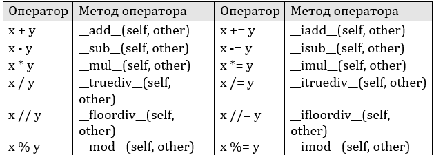
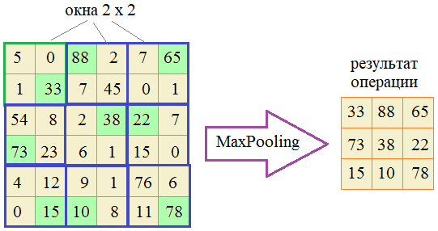

## Магические методы __add__, __sub__, __mul__, __truediv__



[Текстовый вариант](<https://proproprogs.ru/python_oop/magicheskie-metody-add-sub-mul-truediv>)

---

**Подвиг 4.** (task_1.py)

Известно, что в Python мы можем соединять два списка между собой с помощью оператора +:

    lst = [1, 2, 3] + [4.5, -3.6, 0.78]

Но нет реализации оператора -, который бы убирал из списка соответствующие значения вычитаемого списка, как это показано в примере:

    lst = [1, 2, 3, 4, 5, 6] - [5, 6, 7, 8, 1] # [2, 3, 4] (порядок следования оставшихся элементов списка должен сохраняться)

Давайте это поправим и создадим такой функционал. Для этого нужно объявить класс с именем NewList, объекты которого создаются командами:
```python
lst = NewList() # пустой список
lst = NewList([-1, 0, 7.56, True]) # список с начальными значениями
```
Реализуйте для этого класса работу с оператором вычитания, чтобы над объектами класса NewList можно было выполнять следующие действия:
```python
lst1 = NewList([1, 2, -4, 6, 10, 11, 15, False, True])
lst2 = NewList([0, 1, 2, 3, True])
res_1 = lst1 - lst2 # NewList: [-4, 6, 10, 11, 15, False]
lst1 -= lst2 # NewList: [-4, 6, 10, 11, 15, False]
res_2 = lst2 - [0, True] # NewList: [1, 2, 3]
res_3 = [1, 2, 3, 4.5] - res_2 # NewList: [4.5]
a = NewList([2, 3])
res_4 = [1, 2, 2, 3] - a # NewList: [1, 2]
```
Также в классе NewList необходимо объявить метод:

get_list() - для возвращения результирующего списка объекта класса NewList

Например:

    lst = res_2.get_list() # [1, 2, 3]

P.S. В программе требуется только объявить класс. На экран ничего выводить не нужно.

---

**Подвиг 5.** (task_2.py)

Объявите класс с именем ListMath, объекты которого можно создавать командами:
```python
lst1 = ListMath() # пустой список
lst2 = ListMath([1, 2, -5, 7.68]) # список с начальными значениями
```
В качестве значений элементов списка объекты класса ListMath должны отбирать только целые и вещественные числа, остальные игнорировать (если указываются в списке). Например:

    lst = ListMath([1, "abc", -5, 7.68, True]) # ListMath: [1, -5, 7.68]

В каждом объекте класса ListMath должен быть публичный атрибут:

lst_math - ссылка на текущий список объекта (для каждого объекта создается свой список).

Также с объектами класса ListMath должны работать следующие операторы:
```python
lst = lst + 76 # сложение каждого числа списка с определенным числом
lst = 6.5 + lst # сложение каждого числа списка с определенным числом
lst += 76.7  # сложение каждого числа списка с определенным числом
lst = lst - 76 # вычитание из каждого числа списка определенного числа
lst = 7.0 - lst # вычитание из числа каждого числа списка
lst -= 76.3
lst = lst * 5 # умножение каждого числа списка на указанное число (в данном случае на 5)
lst = 5 * lst # умножение каждого числа списка на указанное число (в данном случае на 5)
lst *= 5.54
lst = lst / 13 # деление каждого числа списка на указанное число (в данном случае на 13)
lst = 3 / lst # деление числа на каждый элемент списка
lst /= 13.0
```
При использовании бинарных операторов +, -, *, / должны формироваться новые объекты класса ListMath с новыми списками, прежние списки не меняются.

При использовании операторов *+=, -=, *=, /=* значения должны меняться внутри списка текущего объекта (новый объект не создается).

P.S. В программе достаточно только объявить класс. На экран ничего выводить не нужно.

---

**Подвиг 6.** (task_3.py)

Ранее, в одном из подвигов мы с вами создавали односвязный список с объектами класса StackObj (когда один объект ссылается на следующий и так далее):


Давайте снова создадим такую структуру данных. Для этого объявим два класса:

`Stack` - для управления односвязным списком в целом;\
`StackObj` - для представления отдельных объектов в односвязным списком.

Объекты класса StackObj должны создаваться командой:

    obj = StackObj(data)

где data - строка с некоторыми данными.

Каждый объект класса StackObj должен иметь локальные приватные атрибуты:

`__data` - ссылка на строку с переданными данными;\
`__next` - ссылка на следующий объект односвязного списка (если следующего нет, то __next = None).

Объекты класса Stack создаются командой:

    st = Stack()

и каждый из них должен содержать локальный атрибут:

`top` - ссылка на первый объект односвязного списка (если объектов нет, то top = None).

Также в классе Stack следует объявить следующие методы:

<u>push_back(self, obj)</u> - добавление объекта класса StackObj в конец односвязного списка;\
<u>pop_back(self)</u> - удаление последнего объекта из односвязного списка.

Дополнительно нужно реализовать следующий функционал (в этих операциях копии односвязного списка создавать не нужно):

```python
# добавление нового объекта класса StackObj в конец односвязного списка st
st = st + obj
st += obj

# добавление нескольких объектов в конец односвязного списка
st = st * ['data_1', 'data_2', ..., 'data_N']
st *= ['data_1', 'data_2', ..., 'data_N']
```
В последних двух строчках должны автоматически создаваться N объектов класса StackObj с данными, взятыми из списка (каждый элемент списка для очередного добавляемого объекта).

P.S. В программе достаточно только объявить классы. На экран ничего выводить не нужно.

---

**Подвиг 7.** (task_4.py)

Вам поручается создать программу по учету книг (библиотеку). Для этого необходимо в программе объявить два класса:

Lib - для представления библиотеки в целом;\
Book - для описания отдельной книги.

Объекты класса Book должны создаваться командой:

    book = Book(title, author, year)

где <u>title</u> - заголовок книги (строка); <u>author</u> - автор книги (строка); <u>year</u> - год издания (целое число).

Объекты класса Lib создаются командой:

    lib = Lib()

Каждый объект должен содержать локальный публичный атрибут:

<u>book_list</u> - ссылка на список из книг (объектов класса Book). Изначально список пустой.

Также объекты класса Lib должны работать со следующими операторами:

```python
lib = lib + book # добавление новой книги в библиотеку
lib += book

lib = lib - book # удаление книги book из библиотеки (удаление происходит по ранее созданному объекту book класса Book)
lib -= book

lib = lib - indx # удаление книги по ее порядковому номеру (индексу: отсчет начинается с нуля)
lib -= indx
```
При реализации бинарных операторов + и - создавать копии библиотек (объекты класса Lib) не нужно.

Также с объектами класса Lib должна работать функция:

    n = len(lib) # n - число книг

которая возвращает число книг в библиотеке.

P.S. В программе достаточно только объявить классы. На экран ничего выводить не нужно.

---

**Подвиг 8.** (task_5.py)

Вам необходимо создать простую программу по учету семейного бюджета. Для этого в программе объявите два класса с именами:

Budget - для управления семейным бюджетом;
Item - пункт расходов бюджета.

Объекты класса Item должны создаваться командой:

    it = Item(name, money)

где <u>name</u> - название статьи расхода; <u>money</u> - сумма расходов (вещественное или целое число).

Соответственно, в каждом объекте класса Item должны формироваться локальные атрибуты name и money с переданными значениями. Также с объектами класса Item должны выполняться следующие операторы:

    s = it1 + it2 # сумма для двух статей расходов

и в общем случае:

    s = it1 + it2 + ... + itN # сумма N статей расходов

При суммировании оператор + должен возвращать число - вычисленную сумму по атрибутам money соответствующих объектов класса Item.

Объекты класса Budget создаются командой:

    my_budget = Budget()

А сам класс Budget должен иметь следующие методы:

<u>add_item(self, it)</u> - добавление статьи расхода в бюджет (it - объект класса Item);\
<u>remove_item(self, indx)</u> - удаление статьи расхода из бюджета по его порядковому номеру indx (индексу: отсчитывается с нуля);\
<u>get_items(self)</u> - возвращает список всех статей расходов (список из объектов класса Item).

Пример использования классов (эти строчки в программе писать не нужно):

```python
my_budget = Budget()
my_budget.add_item(Item("Курс по Python ООП", 2000))
my_budget.add_item(Item("Курс по Django", 5000.01))
my_budget.add_item(Item("Курс по NumPy", 0))
my_budget.add_item(Item("Курс по C++", 1500.10))

# вычисление общих расходов
s = 0
for x in my_budget.get_items():
    s = s + x
```
P.S. В программе требуется только объявить класс. На экран ничего выводить не нужно.

---

**Подвиг 9.** (task_6.py)

Объявите класс Box3D для представления прямоугольного параллелепипеда (бруска), объекты которого создаются командой:

    box = Box3D(width, height, depth)

где width, height, depth - ширина, высота и глубина соответственно (числа: целые или вещественные)

В каждом объекте класса Box3D должны создаваться публичные атрибуты:

width, height, depth - ширина, высота и глубина соответственно.

С объектами класса Box3D должны выполняться следующие операторы:

```python
box1 = Box3D(1, 2, 3)
box2 = Box3D(2, 4, 6)

box = box1 + box2 # Box3D: width=3, height=6, depth=9 (соответствующие размерности складываются)
box = box1 * 2    # Box3D: width=2, height=4, depth=6 (каждая размерность умножается на 2)
box = 3 * box2    # Box3D: width=6, height=12, depth=18
box = box2 - box1 # Box3D: width=1, height=2, depth=3 (соответствующие размерности вычитаются)
box = box1 // 2   # Box3D: width=0, height=1, depth=1 (соответствующие размерности целочисленно делятся на 2)
box = box2 % 3    # Box3D: width=2, height=1, depth=0
```
При каждой арифметической операции следует создавать новый объект класса Box3D с соответствующими значениями локальных атрибутов.

P.S. В программе достаточно только объявить класс Box3D. На экран ничего выводить не нужно.

---

**Подвиг 10 (на повторение).** (task_7.py)

В нейронных сетях использую операцию под названием Max Pooling. Суть ее состоит в сканировании прямоугольной таблицы чисел (матрицы) окном определенного размера (обычно, 2x2 элемента) и выбора наибольшего значения в пределах этого окна:



Или, если окна выходят за пределы матрицы, то они пропускаются (игнорируются):


Мы повторим эту процедуру. Для этого в программе нужно объявить класс с именем MaxPooling, объекты которого создаются командой:

    mp = MaxPooling(step=(2, 2), size=(2,2))

где <u>step</u> - шаг смещения окна по горизонтали и вертикали;\
<u>size</u> - размер окна по горизонтали и вертикали.

Параметры *step и size* по умолчанию должны принимать кортеж со значениями (2, 2).

Для выполнения операции Max Pooling используется команда:

    res = mp(matrix)

где <u>matrix</u> - прямоугольная таблица чисел;\
<u>res</u> - ссылка на результат обработки таблицы matrix (должна создаваться новая таблица чисел.

Прямоугольную таблицу чисел следует описывать вложенными списками. Если при сканировании таблицы часть окна выходит за ее пределы, то эти данные отбрасывать (не учитывать все окно).

Если matrix не является прямоугольной таблицей или содержит хотя бы одно не числовое значение, то должно генерироваться исключение командой:

    raise ValueError("Неверный формат для первого параметра matrix.")

Пример использования класса (эти строчки в программе писать не нужно):

```python
mp = MaxPooling(step=(2, 2), size=(2,2))
res = mp([
    [1, 2, 3, 4],
    [5, 6, 7, 8],
    [9, 8, 7, 6],
    [5, 4, 3, 2]
    ])    # [[6, 8], [9, 7]]
```
Результатом будет таблица чисел:
```code
6 8
9 7
```
P.S. В программе достаточно объявить только класс. Выводить на экран ничего не нужно.
