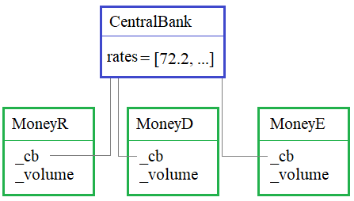

## Магические методы сравнения


---

**Подвиг 3.** (task_1.py)

Объявите класс Track (маршрут), объекты которого создаются командой:

    track = Track(start_x, start_y)

где start_x, start_y - координаты начала маршрута (целые или вещественные числа).

Каждый линейный сегмент маршрута определяется классом TrackLine, объекты которого создаются командой:

    line = TrackLine(to_x, to_y, max_speed)

где to_x, to_y - координаты следующей точки маршрута (целые или вещественные числа); max_speed - максимальная скорость на данном участке (целое число).

Для формирования и работы с маршрутом в классе Track должны быть объявлены следующие методы:

add_track(self, tr) - добавление линейного сегмента маршрута (следующей точки);\
get_tracks(self) - получение кортежа из объектов класса TrackLine.

Также для объектов класса Track должны быть реализованные следующие операции сравнения:
```python
track1 == track2  # маршруты равны, если равны их длины
track1 != track2  # маршруты не равны, если не равны их длины
track1 > track2  # True, если длина пути для track1 больше, чем для track2
track1 < track2  # True, если длина пути для track1 меньше, чем для track2
```
И функция:

    n = len(track) # возвращает целочисленную длину маршрута (привести к типу int) для объекта track

Создайте два маршрута track1 и track2 с координатами:

    1-й маршрут: (0; 0), (2; 4), (5; -4) и max_speed = 100
    2-й маршрут: (0; 1), (3; 2), (10; 8) и max_speed = 90

Сравните их между собой на равенство. Результат сравнения сохраните в переменной res_eq.

P.S. На экран в программе ничего выводить не нужно.

---

**Подвиг 4.** (task_2.py)

Объявите класс Dimensions (габариты) с атрибутами:

    MIN_DIMENSION = 10
    MAX_DIMENSION = 10000

Каждый объект класса Dimensions должен создаваться командой:

    d3 = Dimensions(a, b, c)   # a, b, c - габаритные размеры

Значения a, b, c должны сохраняться в локальных приватных атрибутах __a, __b, __c объектах этого класса.

Для изменения и доступа к приватным атрибутам в классе Dimensions должны быть объявлены объекты-свойства (property) с именами: **a, b, c**. Причем, в момент присваивания нового значения должна выполняться проверка попадания числа в диапазон [MIN_DIMENSION; MAX_DIMENSION]. Если число не попадает, то оно игнорируется и существующее значение не меняется.

С объектами класса Dimensions должны выполняться следующие операторы сравнения:
```python
dim1 >= dim2   # True, если объем dim1 больше или равен объему dim2
dim1 > dim2    # True, если объем dim1 больше объема dim2
dim1 <= dim2   # True, если объем dim1 меньше или равен объему dim2
dim1 < dim2    # True, если объем dim1 меньше объема dim2
```
Объявите в программе еще один класс с именем ShopItem (товар), объекты которого создаются командой:

    item = ShopItem(name, price, dim)

где <u>name</u> - название товара (строка); price - цена товара (целое или вещественное число); dim - габариты товара (объект класса Dimensions).

В каждом объекте класса ShopItem должны создаваться локальные атрибуты:

name - название товара;\
price - цена товара;\
dim - габариты товара (объект класса Dimensions).

Создайте список с именем lst_shop из четырех товаров со следующими данными:

\- кеды; 1024; (40, 30, 120)\
\- зонт; 500.24; (10, 20, 50)\
\- холодильник; 40000; (2000, 600, 500)\
\- табуретка; 2000.99; (500, 200, 200)

Сформируйте новый список **lst_shop_sorted** с упорядоченными по возрастанию объема (габаритов) товаров списка lst_shop, используя стандартную функцию <u>sorted()</u> языка Python и ее параметр key для настройки сортировки. Прежний список lst_shop должен оставаться без изменений.

P.S. На экран в программе ничего выводить не нужно.

---

**Подвиг 5.** (task_3.py)

Имеется стихотворение, представленное следующим списком строк:
```python
stich = ["Я к вам пишу – чего же боле?",
        "Что я могу еще сказать?",
        "Теперь, я знаю, в вашей воле",
        "Меня презреньем наказать.",
        "Но вы, к моей несчастной доле",
        "Хоть каплю жалости храня,",
        "Вы не оставите меня."]
```
Необходимо в каждой строчке этого стиха убрать символы "–?!,.;" в начале и в конце каждого слова и разбить строку по словам (слова разделяются одним или несколькими пробелами). На основе полученного списка слов, создать объект класса StringText командой:

    st = StringText(lst_words)

где lst_words - список из слов одной строчки стихотворения.

С объектами класса StringText должны быть реализованы операторы сравнения:
```python
st1 > st2   # True, если число слов в st1 больше, чем в st2
st1 >= st2  # True, если число слов в st1 больше или равно st2
st1 < st2   # True, если число слов в st1 меньше, чем в st2
st1 <= st2  # True, если число слов в st1 меньше или равно st2
```
Все объекты класса StringText (для каждой строчки стихотворения) сохранить в списке **lst_text**. Затем, сформировать новый список **lst_text_sorted** из отсортированных объектов класса StringText по убыванию числа слов. Для сортировки использовать стандартную функцию sorted() языка Python. После этого преобразовать данный список (lst_text_sorted) в список из строк (объекты заменяются на соответствующие строки, между словами ставится пробел).

P.S. На экран в программе ничего выводить не нужно.

---

**Подвиг 6.** (task_4.py)

Ваша задача написать программу поиска слова в строке. Задача усложняется тем, что слово должно определяться в разных его формах. Например, слово:

    программирование

может иметь следующие формы:

    программирование, программированию, программированием, программировании, программирования, программированиям, программированиями, программированиях

Для решения этой задачи необходимо объявить класс Morph (морфология), объекты которого создаются командой:

    mw = Morph(word1, word2, ..., wordN)

где word1, word2, ..., wordN - возможные формы слова.

В классе Morph реализовать методы:

<u>add_word(self, word)</u> - добавление нового слова (если его нет в списке слов объекта класса Morph);\
<u>get_words(self)</u> - получение кортежа форм слов.

Также с объектами класса Morph должны выполняться следующие операторы сравнения:
```python
mw1 == "word"  # True, если объект mv1 содержит слово "word" (без учета регистра)
mw1 != "word"  # True, если объект mv1 не содержит слово "word" (без учета регистра)
```
И аналогичная пара сравнений:
```python
"word" == mw1
"word" != mw1
```
После создания класса Morph, формируется список dict_words из объектов этого класса, для следующих слов с их словоформами:

\- связь, связи, связью, связей, связям, связями, связях\
\- формула, формулы, формуле, формулу, формулой, формул, формулам, формулами, формулах\
\- вектор, вектора, вектору, вектором, векторе, векторы, векторов, векторам, векторами, векторах\
\- эффект, эффекта, эффекту, эффектом, эффекте, эффекты, эффектов, эффектам, эффектами, эффектах\
\- день, дня, дню, днем, дне, дни, дням, днями, днях

Затем, прочитайте строку из входного потока командой:

    text = input()

Найдите все вхождения слов из списка dict_words (используя операторы сравнения) в строке text (без учета регистра, знаков пунктуаций и их словоформы). Выведите на экран полученное число.

**Sample Input:**

    Мы будем устанавливать связь завтра днем.

**Sample Output:**

    2

---

**Подвиг 7 (на повторение).** (task_5.py)

Перед вами стоит задача выделения файлов с определенными расширениями из списка файлов, например:
```python
filenames = ["boat.jpg", "ans.web.png", "text.txt", "www.python.doc", "my.ava.jpg", "forest.jpeg", "eq_1.png", "eq_2.xls"]
```
Для этого необходимо объявить класс *FileAcceptor*, объекты которого создаются командой:

    acceptor = FileAcceptor(ext1, ..., extN)

где ext1, ..., extN - строки с допустимыми расширениями файлов, например: 'jpg', 'bmp', 'jpeg'.

После этого предполагается использовать объект acceptor в стандартной функции *filter* языка Python следующим образом:

    filenames = list(filter(acceptor, filenames))

То есть, объект acceptor должен вызываться как функция:

    acceptor(filename)

и возвращать True, если файл с именем filename содержит расширения, указанные при создании acceptor, и False - в противном случае. Кроме того, с объектами класса FileAcceptor должен выполняться оператор:

    acceptor12 = acceptor1 + acceptor2

Здесь формируется новый объект acceptor12 с уникальными расширениями первого и второго объектов. Например:
```python
acceptor1 = FileAcceptor("jpg", "jpeg", "png")
acceptor2 = FileAcceptor("png", "bmp")
acceptor12 = acceptor1 + acceptor2    # ("jpg", "jpeg", "png", "bmp")
```
Пример использования класса (эти строчки в программе писать не нужно):
```python
acceptor_images = FileAcceptor("jpg", "jpeg", "png")
acceptor_docs = FileAcceptor("txt", "doc", "xls")
filenames = list(filter(acceptor_images + acceptor_docs, filenames))
```
P.S. На экран в программе ничего выводить не нужно.

---

**Подвиг 8.** (task_6.py)

В программе необходимо объявить классы для работы с кошельками в разных валютах:

    MoneyR - для рублевых кошельков
    MoneyD - для долларовых кошельков
    MoneyE - для евро-кошельков



Объекты этих классов могут создаваться командами:
```python
rub = MoneyR()   # с нулевым балансом
dl = MoneyD(1501.25) # с балансом в 1501.25 долларов
euro = MoneyE(100)  # с балансом в 100 евро
```
В каждом объекте этих классов должны формироваться локальные атрибуты:

__cb - ссылка на класс CentralBank (центральный банк, изначально None);\
__volume - объем денежных средств в кошельке (если не указано, то 0).

Также в классах MoneyR, MoneyD и MoneyE должны быть объекты-свойства (property) для работы с локальными атрибутами:

cb - для изменения и считывания данных из переменной __cb;
volume - для изменения и считывания данных из переменной __volume.

Объекты классов должны поддерживать следующие операторы сравнения:
```python
rub < dl
dl >= euro
rub == euro  # значения сравниваются по текущему курсу центрального банка с погрешностью 0.1 (плюс-минус)
euro > rub
```
При реализации операторов сравнения считываются соответствующие значения __volume из сравниваемых объектов и приводятся к рублевому эквиваленту в соответствии с курсом валют центрального банка.

Чтобы каждый объект классов MoneyR, MoneyD и MoneyE "знал" текущие котировки, необходимо в программе объявить еще один класс **CentralBank**. Объекты класса CentralBank создаваться не должны (запретить), при выполнении команды:

    cb = CentralBank()

должно просто возвращаться значение None. А в самом классе должен присутствовать атрибут:

    rates = {'rub': 72.5, 'dollar': 1.0, 'euro': 1.15}

Здесь числа (в значениях словаря) - курс валюты по отношению к доллару.

Также в CentralBank должен быть метод уровня класса:

<u>register(cls, money)</u> - для регистрации объектов классов MoneyR, MoneyD и MoneyE.

При регистрации значение __cb объекта money должно ссылаться на класс CentralBank. Через эту переменную объект имеет возможность обращаться к атрибуту rates класса CentralBank и брать нужные котировки.

Если кошелек не зарегистрирован, то при операциях сравнения должно генерироваться исключение:

    raise ValueError("Неизвестен курс валют.")

Пример использования классов (эти строчки в программе писать не нужно):
```python
CentralBank.rates = {'rub': 72.5, 'dollar': 1.0, 'euro': 1.15}

r = MoneyR(45000)
d = MoneyD(500)

CentralBank.register(r)
CentralBank.register(d)

if r > d:
    print("неплохо")
else:
    print("нужно поднажать")
```
P.S. В программе на экран ничего выводить не нужно, только объявить классы.

---

**Подвиг 9 (релакс).** (task_7.py)

Необходимо объявить класс Body (тело), объекты которого создаются командой:

    body = Body(name, ro, volume)

где <u>name</u> - название тела (строка); <u>ro</u> - плотность тела (число: вещественное или целочисленное); <u>volume</u> - объем тела  (число: вещественное или целочисленное).

Для объектов класса Body должны быть реализованы операторы сравнения:
```python
body1 > body2  # True, если масса тела body1 больше массы тела body2
body1 == body2 # True, если масса тела body1 равна массе тела body2
body1 < 10     # True, если масса тела body1 меньше 10
body2 == 5     # True, если масса тела body2 равна 5
```
Масса тела вычисляется по формуле:

    m = ro * volume

P.S. В программе только объявить класс, выводить на экран ничего не нужно.

---

**Подвиг 10.** (task_8.py)

Объявите в программе класс с именем Box (ящик), объекты которого должны создаваться командой:

    box = Box()

А сам класс иметь следующие методы:

add_thing(self, obj) - добавление предмета obj (объект другого класса Thing) в ящик;\
get_things(self) - получение списка объектов ящика.

Для описания предметов необходимо объявить еще один класс Thing. Объекты этого класса должны создаваться командой:

    obj = Thing(name, mass)

где <u>name</u> - название предмета (строка); <u>mass</u> - масса предмета (число: целое или вещественное).
Объекты класса Thing должны поддерживать операторы сравнения:

    obj1 == obj2
    obj1 != obj2

Предметы считаются равными, если у них одинаковые названия name (без учета регистра) и массы mass.

Также объекты класса Box должны поддерживать аналогичные операторы сравнения:

    box1 == box2
    box1 != box2

Ящики считаются равными, если одинаковы их содержимое (для каждого объекта класса Thing одного ящика и можно найти ровно один равный объект из второго ящика).

Пример использования классов:
```python
b1 = Box()
b2 = Box()

b1.add_thing(Thing('мел', 100))
b1.add_thing(Thing('тряпка', 200))
b1.add_thing(Thing('доска', 2000))

b2.add_thing(Thing('тряпка', 200))
b2.add_thing(Thing('мел', 100))
b2.add_thing(Thing('доска', 2000))

res = b1 == b2 # True
```
P.S. В программе только объявить классы, выводить на экран ничего не нужно.
