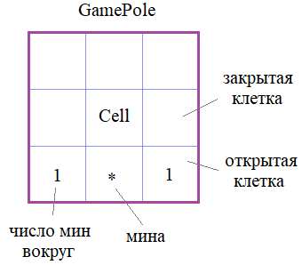

## Метод \_\_bool__


**Подвиг 4.** (task_1.py)

Объявите в программе класс Player (игрок), объекты которого создаются командой:

    player = Player(name, old, score)

где name - имя игрока (строка);\
old - возраст игрока (целое число); \
score - набранные очки в игре (целое число). В каждом объекте класса Player должны создаваться аналогичные локальные атрибуты: name, old, score.

С объектами класса Player должна работать функция:

    bool(player)

которая возвращает True, если число очков больше нуля, и False - в противном случае.

С помощью команды:

    lst_in = list(map(str.strip, sys.stdin.readlines()))

считываются строки из входного потока в список строк lst_in. Каждая строка записана в формате:

    "имя; возраст; очки"

Например:
```
Балакирев; 34; 2048
Mediel; 27; 0
Влад; 18; 9012
Nina P; 33; 0
```
Каждую строку списка lst_in необходимо представить в виде объекта класса Player с соответствующими данными. И из этих объектов сформировать список players.

Отфильтруйте этот список (создайте новый: players_filtered), оставив всех игроков с числом очков больше нуля. Используйте для этого стандартную функцию filter() совместно с функцией bool() языка Python.

P.S. На экран ничего выводить не нужно.

**Sample Input:**
```
Балакирев; 34; 2048
Mediel; 27; 0
Влад; 18; 9012
Nina P; 33; 0
```
**Sample Output:**
```
```
---

**Подвиг 5.** (task_2.py)

Объявите в программе класс MailBox (почтовый ящик), объекты которого создаются командой:

    mail = MailBox()

Каждый объект этого класса должен содержать локальный публичный атрибут:

inbox_list - список из принятых писем.

Также в классе MailBox должен присутствовать метод:

receive(self) - прием новых писем

Этот метод должен читать данные из входного потока командой:

    lst_in = list(map(str.strip, sys.stdin.readlines()))

В результате формируется список lst_in из строк. Каждая строка записана в формате:

    "от кого; заголовок; текст письма"

Например:
```
sc_lib@list.ru; От Балакирева; Успехов в IT!
mail@list.ru; Выгодное предложение; Вам одобрен кредит.
mail123@list.ru; Розыгрыш; Вы выиграли 1 млн. руб. Переведите 30 тыс. руб., чтобы его получить.
```
Каждая строчка списка lst_in должна быть представлена объектом класса MailItem, объекты которого создаются командой:

    item = MailItem(mail_from, title, content)

где *mail_from* - email отправителя (строка);\
 *title* - заголовок письма (строка), \
 *content* - содержимое письма (строка).

  В каждом объекте класса MailItem должны формироваться соответствующие локальные атрибуты (с именами: **mail_from, title, content**). И дополнительно атрибут **is_read** (прочитано ли) с начальным значением False.

В классе MailItem должен быть реализован метод:

*set_read(self, fl_read)* - для отметки, что письмо прочитано (метод должен устанавливать атрибут is_read = fl_read, если True, то письмо прочитано, если False, то не прочитано).

С каждым объектом класса MailItem должна работать функция:

    bool(item)

которая возвращает True для прочитанного письма и False для непрочитанного.

Вызовите метод:

    mail.receive()

Отметьте первое и последнее письмо в списке mail.inbox_list, как прочитанное (используйте для этого метод set_read). Затем, сформируйте в программе список (глобальный) с именем inbox_list_filtered из прочитанных писем, используя стандартную функцию filter() совместно с функцией bool() языка Python.

P.S. На экран ничего выводить не нужно.

**Sample Input:**
```
sc_lib@list.ru; От Балакирева; Успехов в IT!
mail@list.ru; Выгодное предложение; Вам одобрен кредит.
mail123@list.ru; Розыгрыш; Вы выиграли 1 млн. руб. Переведите 30 тыс. руб., чтобы его получить.
```
**Sample Output:**
```
```

---

**Подвиг 6 (релакс).** (task_3.py)

Объявите класс Line, объекты которого создаются командой:

    line = Line(x1, y1, x2, y2)

где x1, y1, x2, y2 - координаты начала линии (x1, y1) и координаты конца линии (x2, y2). Могут быть произвольными числами. В объектах класса Line должны создаваться соответствующие локальные атрибуты с именами x1, y1, x2, y2.

В классе Line определить магический метод \_\_len__() так, чтобы функция:

    bool(line)

возвращала False, если длина линии меньше 1.

P.S. На экран ничего выводить не нужно. Только объявить класс.

---

**Подвиг 7.** (task_4.py)

Объявите класс Ellipse (эллипс), объекты которого создаются командами:
```python
el1 = Ellipse()  # без создания локальных атрибутов x1, y1, x2, y2
el2 = Ellipse(x1, y1, x2, y2)
```
где x1, y1 - координаты (числа) левого верхнего угла; x2, y2 - координаты (числа) нижнего правого угла. Первая команда создает объект класса Ellipse без локальных атрибутов x1, y1, x2, y2. Вторая команда создает объект с локальными атрибутами x1, y1, x2, y2 и соответствующими переданными значениями.

В классе Ellipse объявите магический метод \_\_bool__(), который бы возвращал True, если все локальные атрибуты x1, y1, x2, y2 существуют и False - в противном случае.

Также в классе Ellipse нужно реализовать метод:

get_coords() - для получения кортежа текущих координат объекта.

Если координаты отсутствуют (нет локальных атрибутов x1, y1, x2, y2), то метод get_coords() должен генерировать исключение командой:

    raise AttributeError('нет координат для извлечения')

Сформируйте в программе список с именем **lst_geom**, содержащий четыре объекта класса Ellipse. Два объекта должны быть созданы командой

    Ellipse()

и еще два - командой:

    Ellipse(x1, y1, x2, y2)

Переберите список в цикле и вызовите метод get_coords() только для объектов, имеющих координаты x1, y1, x2, y2. (Помните, что для этого был определен магический метод \_\_bool__()).

P.S. На экран ничего выводить не нужно.

---

**Большой подвиг 8.** (task_5.py)

Вы начинаете разрабатывать игру "Сапер". Для этого вам нужно уметь представлять и управлять игровым полем. Будем полагать, что оно имеет размеры N x M клеток. Каждая клетка будет представлена объектом класса Cell и содержать либо число мин вокруг этой клетки, либо саму мину.



Для начала в программе объявите класс GamePole, который будет создавать и управлять игровым полем. Объект этого класса должен формироваться командой:

    pole = GamePole(N, M, total_mines)

И, так как поле в игре одно, то нужно контролировать создание только одного объекта класса GamePole (используйте паттерн Singleton, о котором мы с вами говорили, когда рассматривали магический метод __new__()).

Объект pole должен иметь локальный приватный атрибут:

__pole_cells - двумерный (вложенный) кортеж, размерами N x M элементов (N строк и M столбцов), состоящий из объектов класса Cell.

Для доступа к этой коллекции объявите в классе GamePole объект-свойство (property):

pole - только для чтения (получения) ссылки на коллекцию __pole_cells.

Далее, в самом классе GamePole объявите следующие методы:

<u>init_pole()</u> - для инициализации начального состояния игрового поля (расставляет мины и делает все клетки закрытыми);\
<u>open_cell(i, j)</u> - открывает ячейку с индексами (i, j); нумерация индексов начинается с нуля; метод меняет значение атрибута __is_open объекта Cell в ячейке (i, j) на True;\
<u>show_pole()</u> - отображает игровое поле в консоли (как именно сделать - на ваше усмотрение, этот метод - домашнее задание).

Расстановку мин выполняйте случайным образом по игровому полю (для этого удобно воспользоваться функцией randint модуля random). После расстановки всех total_mines мин, вычислите их количество вокруг остальных клеток (где нет мин). Область охвата - соседние (прилегающие) клетки (8 штук).

В методе open_cell() необходимо проверять корректность индексов (i, j). Если индексы указаны некорректно, то генерируется исключение командой:

    raise IndexError('некорректные индексы i, j клетки игрового поля')

Следующий класс Cell описывает состояние одной ячейки игрового поля. Объекты этого класса создаются командой:

    cell = Cell()

При этом в самом объекте создаются следующие локальные приватные свойства:

__is_mine - булево значение True/False; True - в клетке находится мина, False - мина отсутствует;\
__number - число мин вокруг клетки (целое число от 0 до 8);\
__is_open - флаг того, открыта клетка или закрыта: True - открыта; False - закрыта.

Для работы с этими приватными атрибутами объявите в классе Cell следующие объекты-свойства с именами:

is_mine - для записи и чтения информации из атрибута __is_mine;\
number - для записи и чтения информации из атрибута __number;\
is_open - для записи и чтения информации из атрибута __is_open.

В этих свойствах необходимо выполнять проверку на корректность переданных значений (либо булево значение True/False, либо целое число от 0 до 8). Если передаваемое значение некорректно, то генерировать исключение командой:

    raise ValueError("недопустимое значение атрибута")

С объектами класса Cell должна работать функция:

    bool(cell)

которая возвращает True, если клетка закрыта и False - если открыта.

Пример использования классов (эти строчки в программе писать не нужно):
```python
pole = GamePole(10, 20, 10)  # создается поле размерами 10x20 с общим числом мин 10
pole.init_pole()
if pole.pole[0][1]:
    pole.open_cell(0, 1)
if pole.pole[3][5]:
    pole.open_cell(3, 5)
pole.open_cell(30, 100)  # генерируется исключение IndexError
pole.show_pole()
```
P.S. В программе на экран выводить ничего не нужно, только объявить классы.

---

**Подвиг 9 (на повторение).** (task_6.py)

Объявите в программе класс Vector, объекты которого создаются командой:

    v = Vector(x1, x2, x3,..., xN)

где x1, x2, x3,..., xN - координаты вектора (числа: целые или вещественные).

С каждым объектом класса Vector должны выполняться операторы:
```python
v1 + v2 # суммирование соответствующих координат векторов
v1 - v2 # вычитание соответствующих координат векторов
v1 * v2 # умножение соответствующих координат векторов

v1 += 10 # прибавление ко всем координатам вектора числа 10
v1 -= 10 # вычитание из всех координат вектора числа 10
v1 += v2
v2 -= v1

v1 == v2 # True, если соответствующие координаты векторов равны
v1 != v2 # True, если хотя бы одна пара координат векторов не совпадает
```
При реализации бинарных операторов +, -, * следует создавать новые объекты класса Vector с новыми (вычисленными) координатами. При реализации операторов +=, -= координаты меняются в текущем объекте, не создавая новый.

Если число координат (размерность) векторов v1 и v2 не совпадает, то при операторах +, -, * должно генерироваться исключение командой:

    raise ArithmeticError('размерности векторов не совпадают')

P.S. В программе на экран выводить ничего не нужно, только объявить класс.
