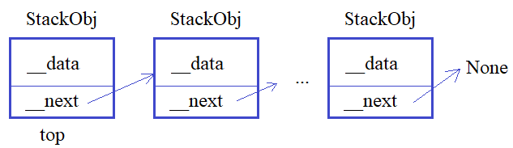

## Методы \_\_getitem__, \_\_setitem__, \_\_delitem__

**Подвиг 2.** (task_1.py)

Объявите класс Record (запись), который описывает одну произвольную запись из БД. Объекты этого класса создаются командой:

    r = Record(field_name1=value1,... , field_nameN=valueN)

где *field_nameX* - наименование поля БД; *valueX* - значение поля из БД.

В каждом объекте класса Record должны автоматически создаваться локальные публичные атрибуты по именам полей (field_name1,... , field_nameN) с соответствующими значениями. Например:

    r = Record(pk=1, title='Python ООП', author='Балакирев')

В объекте r появляются атрибуты:
```python
r.pk # 1
r.title # Python ООП
r.author # Балакирев
```
Также необходимо обеспечить доступ к этим полям (чтение/запись) через индексы следующим образом:
```python
r[0] = 2 # доступ к полю pk
r[1] = 'Супер курс по ООП' # доступ к полю title
r[2] = 'Балакирев С.М.' # доступ к полю author
print(r[1]) # Супер курс по ООП
r[3] # генерируется исключение IndexError
```
Если указывается неверный индекс (не целое число или некорректное целое число), то должно генерироваться исключение командой:

    raise IndexError('неверный индекс поля')

P.S. В программе нужно объявить только класс. Выводить на экран ничего не нужно.

P.P.S. Для создания локальных атрибутов используйте коллекцию \_\_dict__ объекта класса Record.

---

**Подвиг 3.** (task_2.py)

Вам необходимо для навигатора реализовать определение маршрутов. Для этого в программе нужно объявить класс Track, объекты которого создаются командой:

    tr = Track(start_x, start_y)

где start_x, start_y - координата начала пути.

В этом классе должен быть реализован следующий метод:

*add_point(x, y, speed)* - добавление новой точки маршрута (линейный сегмент), который можно пройти со средней скоростью speed.

Также с объектами класса Track должны выполняться команды:
```python
coord, speed = tr[indx] # получение координаты (кортеж с двумя числами) и скорости (число) для линейного сегмента маршрута с индексом indx
tr[indx] = speed # изменение средней скорости линейного участка маршрута по индексу indx
```
Если индекс (indx) указан некорректно (должен быть целым числом от 0 до N-1, где N - число линейных сегментов в маршруте), то генерируется исключение командой:

    raise IndexError('некорректный индекс')

Пример использования класса (эти строчки в программе не писать):
```python
tr = Track(10, -5.4)
tr.add_point(20, 0, 100) # первый линейный сегмент: indx = 0
tr.add_point(50, -20, 80) # второй линейный сегмент: indx = 1
tr.add_point(63.45, 1.24, 60.34) # третий линейный сегмент: indx = 2

tr[2] = 60
c, s = tr[2]
print(c, s)

res = tr[3] # IndexError
```
P.S. В программе нужно объявить только класс. Выводить на экран ничего не нужно.

---

**Подвиг 4.** (task_3.py)

Вам необходимо написать программу по работе с массивом однотипных данных (например, только числа или строки и т.п.). Для этого нужно объявить класс с именем Array, объекты которого создаются командой:

    ar = Array(max_length, cell)

где *max_length* - максимальное количество элементов в массиве; *cell* - ссылка на класс, описывающий отдельный элемент этого массива (см. далее, класс Integer). Начальные значения в ячейках массива (в объектах класса Integer) должны быть равны 0.

Для работы с целыми числами объявите в программе еще один класс с именем Integer, объекты которого создаются командой:

    cell = Integer(start_value)

где start_value - начальное значение ячейки (в данном случае - целое число).

В классе Integer должно быть следующее свойство (property):

**value** - для изменения и считывания значения из ячейки (само значение хранится в локальной приватной переменной; имя придумайте сами).

При попытке присвоить не целое число должно генерироваться исключение командой:

    raise ValueError('должно быть целое число')

Для обращения к отдельным элементам массива в классе Array необходимо определить набор магических методов для следующих операций:
```python
value = ar[0] # получение значения из первого элемента (ячейки) массива ar
ar[1] = value # запись нового значения во вторую ячейку массива ar
```
Если индекс не целое число или число меньше нуля или больше либо равно max_length, то должно генерироваться исключение командой:

    raise IndexError('неверный индекс для доступа к элементам массива')

Пример использования классов (эти строчки в программе не писать):
```python
ar_int = Array(10, cell=Integer)
print(ar_int[3])
print(ar_int) # должны отображаться все значения массива в одну строчку через пробел
ar_int[1] = 10
ar_int[1] = 10.5 # должно генерироваться исключение ValueError
ar_int[10] = 1 # должно генерироваться исключение IndexError
```
P.S. В программе нужно объявить только классы. Выводить на экран ничего не нужно.

P.P.S. В качестве дополнительного домашнего задания: объявите еще один класс Float для работы с вещественными числами и создайте массив, используя тот же класс Array, с этим новым типом данных.

---

**Большой подвиг 5.** (task_4.py)

Вам необходимо написать программу для удобного обращения с таблицами однотипных данных (чисел, строк, булевых значений и т.п.), то есть, все ячейки таблицы должны представлять какой-то один указанный тип.


Для этого в программе необходимо объявить три класса:

TableValues - для работы с таблицей в целом;\
CellInteger - для операций с целыми числами;\
IntegerValue - дескриптор данных для работы с целыми числами.

Начнем с дескриптора IntegerValue. Это должен быть дескриптор данных (то есть, и для записи и считывания значений). Если присваиваемое значение не является целым числом, должно генерироваться исключение командой:

    raise ValueError('возможны только целочисленные значения')

Следующий класс CellInteger описывает одну ячейку таблицы для работы с целыми числами. В этом классе должен быть публичный атрибут (атрибут класса):

*value* - объект дескриптора, класса IntegerValue.

А объекты класса CellInteger должны создаваться командой:

    cell = CellInteger(start_value)

где start_value - начальное значение ячейки (по умолчанию равно 0 и сохраняется в ячейке через дескриптор value).

Наконец, объекты последнего класса TableValues создаются командой:

    table = TableValues(rows, cols, cell=CellInteger)

где *rows, cols* - число строк и столбцов (целые числа); cell - ссылка на класс, описывающий работу с отдельными ячейками таблицы. Если параметр cell не указан, то генерировать исключение командой:

    raise ValueError('параметр cell не указан')

Иначе, в объекте table класса TableValues создается двумерный (вложенный) кортеж с именем cells размером rows x cols, состоящий из объектов указанного класса (в данном примере - класса CellInteger).

Также в классе TableValues предусмотреть возможность обращения к отдельной ячейке по ее индексам, например:
```python
value = table[1, 2] # возвращает значение ячейки с индексом (1, 2)
table[0, 0] = value # записывает новое значение в ячейку (0, 0)
```
Обратите внимание, по индексам сразу должно возвращаться значение ячейки, а не объект класса CellInteger. И то же самое с присваиванием нового значения.

Пример использования классов (эти строчки в программе не писать):
```python
table = TableValues(2, 3, cell=CellInteger)
print(table[0, 1])
table[1, 1] = 10
table[0, 0] = 1.45 # генерируется исключение ValueError

# вывод таблицы в консоль
for row in table.cells:
    for x in row:
        print(x.value, end=' ')
    print()
```
P.S. В программе нужно объявить только классы. Выводить на экран ничего не нужно.

P.P.S. В качестве домашнего задания создайте класс CellString для работы со строками и используйте тот же класс TableValues для этого нового типа данных.

**Последнее:** дескрипторы здесь для повторения. В реальной разработке лучше использовать в таких задачах объекты-свойства (property).

---

**Подвиг 6.** (task_5.py)

Ранее вы уже создавали стек-подобную структуру, когда один объект ссылается на следующий и так по цепочке до последнего:



Для этого в программе объявлялись два класса:

StackObj - для описания объектов стека;\
Stack - для управления стек-подобной структурой.

И, далее, объекты класса StackObj следовало создавать командой:

    obj = StackObj(data)

где data - это строка с некоторым содержимым объекта (данными). При этом каждый объект класса StackObj должен иметь следующие локальные атрибуты:

data - ссылка на строку с данными, указанными при создании объекта;\
next - ссылка на следующий объект класса StackObj (при создании объекта принимает значение None).

Класс Stack предполагается использовать следующим образом:

    st = Stack() # создание объекта стек-подобной структуры

В каждом объекте класса Stack должен быть локальный публичный атрибут:

top - ссылка на первый объект стека (если стек пуст, то top = None).

А в самом классе Stack следующие методы:

push(self, obj) - добавление объекта класса StackObj в конец стека;\
pop(self) - извлечение последнего объекта с его удалением из стека;

Дополнительно в классе Stack нужно объявить магические методы для обращения к объекту стека по его индексу, например:
```python
obj_top = st[0] # получение первого объекта
obj = st[4] # получение 5-го объекта стека
st[2] = StackObj("obj3") # замена прежнего (3-го) объекта стека на новый
```
Если индекс не целое число или число меньше нуля или больше числа объектов в стеке, то должно генерироваться исключение командой:

    raise IndexError('неверный индекс')

Пример использования классов Stack и StackObj (эти строчки в программе не писать):
```python
st = Stack()
st.push(StackObj("obj1"))
st.push(StackObj("obj2"))
st.push(StackObj("obj3"))
st[1] = StackObj("new obj2")
print(st[2].data) # obj3
print(st[1].data) # new obj2
res = st[3] # исключение IndexError
```
P.S. В программе нужно объявить только классы. Выводить на экран ничего не нужно.

---

**Подвиг 7 (познание срезов).**

task_6.py - решение через класс **slice**
task_6_1.py - решение через родительский класс (object)

Объявите в программе класс с именем RadiusVector (радиус-вектор), объекты которого создаются командой:

    v = RadiusVector(x1, x2,..., xN)

где x1, x2,..., xN - координаты радиус-вектора (числа: целые или вещественные).

В каждом объекте класса RadiusVector должен быть локальный атрибут:

coords - список из координат радиус-вектора.

Для доступа к отдельным координатам, реализовать следующий функционал:
```python
coord = v[i] # получение значения i-й координаты (целое число, отсчет с нуля)
coords_1 = v[start:stop] # получение среза (набора) координат в виде кортежа
coords_2 = v[start:stop:step] # получение среза (набора) координат в виде кортежа
v[i] = value # изменение i-й координаты
v[start:stop] = [val_1, val_2, ...] # изменение сразу нескольких координат
v[start:stop:step] = [val_1, val_2, ...] # изменение сразу нескольких координат
```
Пример использования класса (эти строчки в программе не писать):
```python
v = RadiusVector(1, 1, 1, 1)
print(v[1]) # 1
v[:] = 1, 2, 3, 4
print(v[2]) # 3
print(v[1:]) # (2, 3, 4)
v[0] = 10.5
```
P.S. При передаче среза в магических методах \_\_setitem__() и \_\_getitem__() параметр индекса становится объектом класса *slice*. Его можно указывать непосредственно в квадратных скобках упорядоченных коллекций (списков, кортежей и т.п.).

---

**Подвиг 8.** (task_7.py)

Вам нужно реализовать в программе игровое поле для игры "Крестики-нолики". Для этого требуется объявить класс TicTacToe (крестики-нолики), объекты которого создаются командой:

    game = TicTacToe()

Каждый объект game должен иметь публичный атрибут:

pole - игровое поле: кортеж размером 3х3 с объектами класса Cell.

Каждая клетка игрового поля представляется объектом класса Cell и создается командой:

    cell = Cell()

Объекты класса Cell должны иметь следующие публичные локальные атрибуты:

is_free - True, если клетка свободна; False в противном случае;\
value - значение поля: 1 - крестик; 2 - нолик (по умолчанию 0).

Также с каждым объектом класса Cell должна работать функция:

    bool(cell)

которая возвращает True, если клетка свободна (cell.is_free=True) и False в противном случае.

Класс TicTacToe должен иметь следующий метод:

clear() - очистка игрового поля (все клетки заполняются нулями и переводятся в закрытое состояние);

А объекты этого класса должны иметь следующую функциональность (обращение по индексам):
```python
game[0, 0] = 1 # установка нового значения, если поле закрыто
res = game[1, 1] # получение значения центральной ячейки поля (возвращается число)
```
Если указываются некорректные индексы, то должно генерироваться исключение командой:

    raise IndexError('неверный индекс клетки')

Если идет попытка присвоить новое значение в открытую клетку поля, то генерировать исключение:

    raise ValueError('клетка уже занята')

Также должны быть реализованы следующие полные срезы при обращении к клеткам игрового поля:
```python
slice_1 = game[:, indx] # выбираются все элементы (кортеж) столбца с индексом indx
slice_2 = game[indx, :] # выбираются все элементы (кортеж) строки с индексом indx
```
Пример использования классов (эти строчки в программе не писать):
```python
game = TicTacToe()
game.clear()
game[0, 0] = 1
game[1, 0] = 2
# формируется поле:
# 1 0 0
# 2 0 0
# 0 0 0
game[3, 2] = 2 # генерируется исключение IndexError
if game[0, 0] == 0:
    game[0, 0] = 2
v1 = game[0, :]  # 1, 0, 0
v2 = game[:, 0]  # 1, 2, 0
```
P.S. В программе нужно объявить только классы. Выводить на экран ничего не нужно.

P.P.S. При передаче среза в магических методах \_\_setitem__() и \_\_getitem__() параметр индекса становится объектом класса slice. Его можно указывать непосредственно в квадратных скобках упорядоченных коллекций (списков, кортежей и т.п.).

---

**Подвиг 9 (релакс).** (task_8.py)

Объявите в программе класс Bag (сумка), объекты которого создаются командой:

    bag = Bag(max_weight)

где *max_weight* - максимальный суммарный вес предметов, который можно положить в сумку.

Каждый предмет описывается классом Thing и создается командой:

    t = Thing(name, weight)

где *name* - название предмета (строка); weight - вес предмета (вещественное или целочисленное значение). В объектах класса Thing должны автоматически формироваться локальные свойства с теми же именами: name и weight.

В классе Bag должен быть реализован метод:

*add_thing(thing)* - добавление нового объекта thing класса Thing в сумку.

Добавление выполняется только если суммарный вес вещей не превышает параметра max_weight. Иначе, генерируется исключение:

    raise ValueError('превышен суммарный вес предметов')

Также с объектами класса Bag должны выполняться следующие команды:
```python
t = bag[indx] # получение объекта класса Thing по индексу indx (в порядке добавления вещей, начиная с 0)
bag[indx] = t # замена прежней вещи на новую t, расположенной по индексу indx
del bag[indx] # удаление вещи из сумки, расположенной по индексу indx
```
Если индекс в этих командах указывается неверно, то должно генерироваться исключение:

    raise IndexError('неверный индекс')

Пример использования классов (эти строчки в программе не писать):
```python
bag = Bag(1000)
bag.add_thing(Thing('книга', 100))
bag.add_thing(Thing('носки', 200))
bag.add_thing(Thing('рубашка', 500))
bag.add_thing(Thing('ножницы', 300)) # генерируется исключение ValueError
print(bag[2].name) # рубашка
bag[1] = Thing('платок', 100)
print(bag[1].name) # платок
del bag[0]
print(bag[0].name) # платок
t = bag[4] # генерируется исключение IndexError
```
P.S. В программе нужно объявить только классы. Выводить на экран ничего не нужно.

---

**Подвиг 10.** (task_9.py)

Вам необходимо описывать в программе очень большие и разреженные таблицы данных (с большим числом пропусков). Для этого предлагается объявить класс SparseTable, объекты которого создаются командой:

    st = SparseTable()

В каждом объекте этого класса должны создаваться локальные публичные атрибуты:

rows - общее число строк таблицы (начальное значение 0);\
cols - общее число столбцов таблицы (начальное значение 0).

В самом классе SparseTable должны быть объявлены методы:

add_data(row, col, data) - добавление данных data (объект класса Cell) в таблицу по индексам row, col (целые неотрицательные числа);\
remove_data(row, col) - удаление ячейки (объект класса Cell) с индексами (row, col).

При удалении/добавлении новой ячейки должны автоматически пересчитываться атрибуты rows, cols объекта класса SparseTable. Если происходит попытка удалить несуществующую ячейку, то должно генерироваться исключение:

    raise IndexError('ячейка с указанными индексами не существует')

Ячейки таблицы представляют собой объекты класса Cell, которые создаются командой:

    data = Cell(value)

где value - данные ячейки (любой тип).

Хранить ячейки следует в словаре, ключами которого являются индексы (кортеж) i, j, а значениями - объекты класса Cell.

Также с объектами класса SparseTable должны выполняться команды:
```python
res = st[i, j] # получение данных из таблицы по индексам (i, j)
st[i, j] = value # запись новых данных по индексам (i, j)
```
Чтение данных возможно только для существующих ячеек. Если ячейки с указанными индексами нет, то генерировать исключение командой:

    raise ValueError('данные по указанным индексам отсутствуют')

При записи новых значений их следует менять в существующей ячейке или добавлять новую, если ячейка с индексами (i, j) отсутствует в таблице. (Не забывайте при этом пересчитывать атрибуты rows и cols).

Пример использования классов (эти строчки в программе не писать):
```python
st = SparseTable()
st.add_data(2, 5, Cell("cell_25"))
st.add_data(0, 0, Cell("cell_00"))
st[2, 5] = 25 # изменение значения существующей ячейки
st[11, 7] = 'cell_117' # создание новой ячейки
print(st[0, 0]) # cell_00
st.remove_data(2, 5)
print(st.rows, st.cols) # 12, 8 - общее число строк и столбцов в таблице
val = st[2, 5] # ValueError
st.remove_data(12, 3) # IndexError
```
P.S. В программе нужно объявить только классы. Выводить на экран ничего не нужно.
