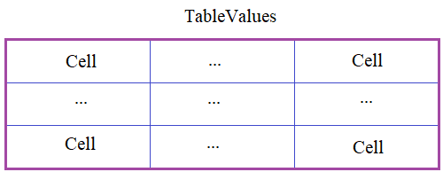

## Методы \_\_iter__ и \_\_next__

Статьи на тему:

- <https://proproprogs.ru/python_oop/magicheskie-metody-iter-next>
- <https://habr.com/ru/company/domclick/blog/674194/>
- <https://www.programiz.com/python-programming/methods/built-in/iter>
- <https://stackoverflow.com/questions/64577138/implement-iter-and-next-in-different>
- <https://habr.com/ru/post/488112/>

task_0.py - примеры из видео-урока

---

**Подвиг 5.** (task_1.py)

Объявите в программе класс Person, объекты которого создаются командой:

    p = Person(fio, job, old, salary, year_job)

где <u>fio</u> - ФИО сотрудника (строка);\
<u>job</u> - наименование должности (строка);\
<u>old</u> - возраст (целое число);\
<u>salary</u> - зарплата (число: целое или вещественное);\
<u>year_job</u> - непрерывный стаж на указанном месте работы (целое число).

В каждом объекте класса Person автоматически должны создаваться локальные атрибуты с такими же именами: fio, job, old, salary, year_job и соответствующими значениями.

Также с объектами класса Person должны поддерживаться следующие команды:
```python
data = p[indx] # получение данных по порядковому номеру (indx) атрибута (порядок: fio, job, old, salary, year_job и начинается с нуля)
p[indx] = value # запись в поле с указанным индексом (indx) нового значения value
for v in p: # перебор всех атрибутов объекта в порядке: fio, job, old, salary, year_job
    print(v)
```
При работе с индексами, проверить корректность значения indx. Оно должно быть целым числом в диапазоне [0; 4]. Иначе, генерировать исключение командой:

    raise IndexError('неверный индекс')

Пример использования класса (эти строчки в программе не писать):
```python
pers = Person('Гейтс Б.', 'бизнесмен', 61, 1000000, 46)
pers[0] = 'Балакирев С.М.'
for v in pers:
    print(v)
pers[5] = 123 # IndexError
```
P.S. В программе нужно объявить только класс. Выводить на экран ничего не нужно.

---

**Подвиг 6.** (task_2.py)

Вам дают задание разработать итератор для последовательного перебора элементов вложенных (двумерных) списков следующей структуры:
```python
lst = [[x00],
       [x10, x11],
       [x20, x21, x22],
       [x30, x31, x32, x33],
       ...
      ]
```
Для этого необходимо в программе объявить класс с именем TriangleListIterator, объекты которого создаются командой:

    it = TriangleListIterator(lst)

где lst - ссылка на перебираемый список.

Затем, с объектами класса TriangleListIterator должны быть доступны следующие операции:
```python
for x in it:  # последовательный перебор всех элементов списка: x00, x10, x11, x20, ...
    print(x)

it_iter = iter(it)
x = next(it_iter)
```
Итератор должен перебирать элементы списка по указанной треугольной форме. Даже если итератору на вход будет передан прямоугольная таблица (вложенный список), то ее перебор все равно должен осуществляться по треугольнику. Если же это невозможно (из-за структуры списка), то естественным образом должна возникать ошибка IndexError: index out of range (выход индекса за допустимый диапазон).

P.S. В программе нужно объявить только класс. Выводить на экран ничего не нужно.

---

**Подвиг 7.** (task_3.py)

Теперь, вам необходимо разработать итератор, который бы перебирал указанные столбцы двумерного списка. Список представляет собой двумерную таблицу из данных:
```python
lst = [[x11, x12, ..., x1N],
       [x21, x22, ..., x2N],
       ...
       [xM1, xM2, ..., xMN]
      ]
```
Для этого в программе необходимо объявить класс с именем IterColumn, объекты которого создаются командой:

    it = IterColumn(lst, column)

где lst - ссылка на двумерный список; column - индекс перебираемого столбца (отсчитывается от 0).

Затем, с объектами класса IterColumn должны быть доступны следующие операции:
```python
it = IterColumn(lst, 1)
for x in it:  # последовательный перебор всех элементов столбца списка: x12, x22, ..., xM2
    print(x)

it_iter = iter(it)
x = next(it_iter)
```
P.S. В программе нужно объявить только класс итератора. Выводить на экран ничего не нужно.

---

**Подвиг 8.** (task_4.py)

Вы несколько раз уже делали стек-подобную структуру, когда объекты последовательно связаны между собой:


Доведем ее функционал до конца. Для этого, по прежнему, нужно объявить классы:

Stack - для представления стека в целом;\
StackObj - для представления отдельных объектов стека.

В классе Stack должны быть методы:

push_back(obj) - для добавления нового объекта obj в конец стека;\
push_front(obj) - для добавления нового объекта obj в начало стека.

В каждом объекте класса Stack должен быть публичный атрибут:

top - ссылка на первый объект стека (при пустом стеке top = None).

Объекты класса StackObj создаются командой:

    obj = StackObj(data)

где data - данные, хранящиеся в объекте стека (строка).

Также в каждом объекте класса StackObj должны быть публичные атрибуты:

data - ссылка на данные объекта;\
next - ссылка на следующий объект стека (если его нет, то next = None).

Наконец, с объектами класса Stack должны выполняться следующие команды:
```python
st = Stack()

st[indx] = value # замена прежних данных на новые по порядковому индексу (indx); отсчет начинается с нуля
data = st[indx]  # получение данных из объекта стека по индексу
n = len(st) # получение общего числа объектов стека

for obj in st: # перебор объектов стека (с начала и до конца)
    print(obj.data)  # отображение данных в консоль
```
При работе с индексами (indx), нужно проверять их корректность. Должно быть целое число от 0 до N-1, где N - число объектов в стеке. Иначе, генерировать исключение командой:

    raise IndexError('неверный индекс')

P.S. В программе нужно объявить только классы. Выводить на экран ничего не нужно.

---

**Подвиг 9.** (task_5.py)

В программе необходимо реализовать таблицу TableValues по следующей схеме:



Каждая ячейка таблицы должна быть представлена классом Cell. Объекты этого класса создаются командой:

    cell = Cell(data)

где *data* - данные в ячейке. В каждом объекте класса Cell должен формироваться локальный приватный атрибут __data с соответствующим значением. Для работы с ним в классе Cell должно быть объект-свойство (property):

data - для записи и считывания информации из атрибута __data.

Сам класс TableValues представляет таблицу в целом, объекты которого создаются командой:

    table = TableValues(rows, cols, type_data)

где rows, cols - число строк и столбцов таблицы; type_data - тип данных ячейки (int - по умолчанию, float, list, str и т.п.). Начальные значения в ячейках таблицы равны 0 (целое число).

С объектами класса TableValues должны выполняться следующие команды:
```python
table[row, col] = value# запись нового значения в ячейку с индексами row, col (индексы отсчитываются с нуля)
value = table[row, col] # считывание значения из ячейки с индексами row, col

for row in table:  # перебор по строкам
    for value in row: # перебор по столбцам
        print(value, end=' ')  # вывод значений ячеек в консоль
    print()
```
При попытке записать по индексам table[row, col] данные другого типа (не совпадающего с атрибутом type_data объекта класса TableValues), должно генерироваться исключение командой:

    raise TypeError('неверный тип присваиваемых данных')

При работе с индексами row, col, необходимо проверять их корректность. Если индексы не целое число или они выходят за диапазон размера таблицы, то генерировать исключение командой:

    raise IndexError('неверный индекс')

P.S. В программе нужно объявить только классы. Выводить на экран ничего не нужно.

---

**Подвиг 10 (на повторение).** (task_6.py)

Объявите класс Matrix (матрица) для операций с матрицами. Объекты этого класса должны создаваться командой:

    m1 = Matrix(rows, cols, fill_value)

где *rows, cols* - число строк и столбцов матрицы; *fill_value* - заполняемое начальное значение элементов матрицы (должно быть число: целое или вещественное). Если в качестве аргументов передаются не числа, то генерировать исключение:

    raise TypeError('аргументы rows, cols - целые числа; fill_value - произвольное число')

Также объекты можно создавать командой:

    m2 = Matrix(list2D)

где list2D - двумерный список (прямоугольный), состоящий из чисел (целых или вещественных). Если список list2D не прямоугольный, или хотя бы один из его элементов не число, то генерировать исключение командой:

    raise TypeError('список должен быть прямоугольным, состоящим из чисел')

Для объектов класса Matrix должны выполняться следующие команды:
```python
matrix = Matrix(4, 5, 0)
res = matrix[0, 0] # возвращается первый элемент матрицы
matrix[indx1, indx2] = value # элементу матрицы с индексами (indx1, indx2) присваивается новое значение
```
Если в результате присвоения тип данных не соответствует числу, то генерировать исключение командой:

    raise TypeError('значения матрицы должны быть числами')

Если указываются недопустимые индексы матрицы (должны быть целыми числами от 0 и до размеров матрицы), то генерировать исключение:

    raise IndexError('недопустимые значения индексов')

Также с объектами класса Matrix должны выполняться операторы:
```python
matrix = m1 + m2 # сложение соответствующих значений элементов матриц m1 и m2
matrix = m1 + 10 # прибавление числа ко всем элементам матрицы m1
matrix = m1 - m2 # вычитание соответствующих значений элементов матриц m1 и m2
matrix = m1 - 10 # вычитание числа из всех элементов матрицы m1
```
Во всех этих операция должна формироваться новая матрица с соответствующими значениями. Если размеры матриц не совпадают (разные хотя бы по одной оси), то генерировать исключение командой:

    raise ValueError('операции возможны только с матрицами равных размеров')

Пример для понимания использования индексов (эти строчки в программе писать не нужно):
```python
mt = Matrix([[1, 2], [3, 4]])
res = mt[0, 0] # 1
res = mt[0, 1] # 2
res = mt[1, 0] # 3
res = mt[1, 1] # 4
```
P.S. В программе нужно объявить только класс. Выводить на экран ничего не нужно.
