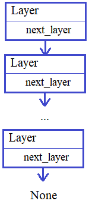
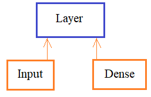

## Наследование в объекто-ориентированном программировании

**Подвиг 4.** (task_1.py)

Наследование часто используют, чтобы вынести общий код дочерних классов в базовый класс. Сделаем такой пример. Объявите в программе базовый класс Animal (животное), объекты которого можно создать командой:

    an = Animal(name, old)

где <u>name</u> - название животного (строка);\
<u>old</u> - возраст животного (целое число).\
Такие же локальные атрибуты (name и old) должны создаваться в объектах класса.

Далее, объявите дочерний класс (от базового Animal) с именем Cat (кошки), объекты которого создаются командой:

    cat = Cat(name, old, color, weight)

где <u>name, old</u> - те же самые параметры, что и в базовом классе; <u>color</u> - цвет кошки (строка); <u>weight</u> - вес кошки (любое положительное число).

В объектах класса Cat должны автоматически формироваться локальные атрибуты: name, old, color, weight. Формирование атрибутов name, old должен выполнять инициализатор базового класса.

По аналогии объявите еще один дочерний класс Dog (собака), объекты которого создаются командой:

    dog = Dog(name, old, breed, size)

здесь <u>name, old</u> - те же самые параметры, что и в базовом классе; <u>breed</u> - порода собаки (строка); <u>size</u> - кортеж в формате (height, length) высота и длина - числа.

В объектах класса Dog по аналогии должны формироваться локальные атрибуты: name, old, breed, size. За формирование атрибутов name, old отвечает инициализатор базового класса.

Наконец, в классах Cat и Dog объявите метод:

get_info() - для получения информации о животном.

Этот метод должен возвращать строку в формате:

    "name: old, <остальные параметры через запятую>"

Например, для следующего объекта класса Cat:

    cat = Cat('кот', 4, 'black', 2.25)

метод get_info должен вернуть строку:

    "кот: 4, black, 2.25"

P.S. В программе достаточно объявить три класса. Выводить на экран ничего не нужно.

---

**Подвиг 5.** (task_2.py)

Иногда наследование используют, чтобы наделить объекты дочерних классов определенным набором атрибутов. Сделаем такой пример.

Предположим, вы разрабатываете программу для интернет-магазина. В этом магазине могут быть как реальные (физические) товары, так и электронные. Для этих двух групп, очевидно, нужен разный набор атрибутов:

- <u>для реальных физических товаров:</u> id, name, price, weight, dims

где <u>id</u> - идентификатор товара (целое число); <u>name</u> - наименование товара (строка); <u>price</u> - цена товара (вещественное число); <u>weight</u> - вес товара (вещественное число); <u>dims</u> = (lenght, width, depth) - длина, ширина, глубина - габариты товара (вещественные числа);

- <u>для электронных товаров:</u> id, name, price, memory, frm

где *id* - идентификатор товара (целое число); *name* - наименование товара (строка); *price* - цена товара (вещественное число); *memory* - занимаемый размер (в байтах - целое число); *frm* - формат данных (строка: pdf, docx и т.п.)

Так как все товары могут идти вперемешку, то мы хотим, чтобы в каждом объекте (для товара) присутствовали все атрибуты:

    id, name, price, weight, dims, memory, frm

с начальными значениями None. А уже, затем, нужным из них будут присвоены конкретные данные.

Для реализации этой логики объявите в программе базовый класс с именем Thing (вещь, предмет), объекты которого могут создаваться командой:

    th = Thing(name, price)

А атрибут id должен формироваться автоматически и быть уникальным для каждого товара (например, можно для каждого нового объекта увеличивать на единицу).

В объектах класса Thing должен формироваться полный набор локальных атрибутов (id, name, price, weight, dims, memory, frm) со значением None, кроме атрибутов: id, name, price.

Далее, нужно объявить два дочерних класса:

Table - для столов;\
ElBook - для электронных книг.

Объекты этих классов должны создаваться командами:
```python
table = Table(name, price, weight, dims)
book = ElBook(name, price, memory, frm)
```
Причем, атрибуты name, price (а также id) следует инициализировать в базовом классе, т.к. они общие для всех товаров. Остальные атрибуты должны либо принимать значение None, если не используются, либо инициализироваться конкретными значениями уже в дочерних классах.

Наконец, в базовом классе Thing объявите метод:

<u>get_data()</u> - для получения кортежа в формате (id, name, price, weight, dims, memory, frm)

Пример использования классов (эти строчки в программе писать не нужно):
```python
table = Table("Круглый", 1024, 812.55, (700, 750, 700))
book = ElBook("Python ООП", 2000, 2048, 'pdf')
print(*table.get_data())
print(*book.get_data())
```
P.S. В программе нужно объявить только классы. Выводить на экран ничего не нужно.

---

**Подвиг 6.** (task_3.py)

Еще один пример, когда в базовом классе прописывается необходимый начальный функционал для дочерних классов.

Известно, что браузер (и не только) может отправлять на сервер различные типы запросов: GET, POST, PUT, DELETE и др. Каждый из этих типов запросов обрабатывается в программе на сервере своим отдельным методом. Чтобы каждый раз не прописывать все необходимые методы в классах при обработке входящих запросов, они выносятся в базовый класс и вызываются из дочерних. Выполним такой пример.

Пусть в программе объявлен следующий базовый класс с именем GenericView:
```python
class GenericView:
    def __init__(self, methods=('GET',)):
        self.methods = methods

    def get(self, request):
        return ""

    def post(self, request):
        pass

    def put(self, request):
        pass

    def delete(self, request):
        pass
```
Здесь каждый метод отвечает за обработку своего типа запроса. Параметр methods - это кортеж или список, состоящий из набора разрешенных запросов: строк с именами соответствующих методов (как правило, пишут заглавными буквами).
Вам необходимо объявить дочерний класс с именем DetailView, объекты которого можно создавать командами:
```python
dv = DetailView()  # по умолчанию methods=('GET',)
dv = DetailView(methods=('PUT', 'POST'))
```
Для инициализации атрибута methods следует вызывать инициализатор базового класса GenericView.

Далее, в классе DetailView нужно определить метод:

    def render_request(self, request, method): ...

который бы имитировал выполнение поступившего на сервер запроса. Здесь request - словарь с набором данных запроса; method - тип запроса (строка: 'get' или 'post' и т.д.).

Например:

    html = dv.render_request({'url': 'https://site.ru/home'}, 'GET')

должен быть обработан запрос как GET-запрос с параметром url и значением 'https://site.ru/home'. Параметр url является обязательным в словаре request для каждого запроса.

В методе render_request() необходимо выполнить проверку: является ли указанный метод (method) разрешенным (присутствует в коллекции methods). Если это не так, то генерировать исключение командой:

    raise TypeError('данный запрос не может быть выполнен')

Если проверка проходит, то выполнить соответствующий метод (или get(), или post(), или put() и т.д. с возвращением результата их работы).

**Подсказка:** для получения ссылки на нужный метод можно воспользоваться магическим методом \_\_getattribute__() или аналогичной функцией getattr()).

Наконец, в дочернем классе DetailView следует переопределить метод get() для нужной нам обработки GET-запросов. В этом методе нужно выполнить проверку, что параметр request является словарем. Если это не так, то генерировать исключение:

    raise TypeError('request не является словарем')

Сделать проверку, что в словаре request присутствует ключ url. Если его нет, то генерировать исключение:

    raise TypeError('request не содержит обязательного ключа url')

Если же все проверки проходят, то вернуть строку в формате:

    "url: <request['url']>"

Пример (эти строчки в программе писать не нужно):
```python
dv = DetailView()
html = dv.render_request({'url': 'https://site.ru/home'}, 'GET')   # url: https://site.ru/home
```
P.S. В программе нужно объявить только классы. Выводить на экран ничего не нужно.

---

**Подвиг 7.** (task_4.py)

С помощью наследования можно как бы "наполнять" дочерние классы нужными качествами (свойствами). Как пример, объявите в программе класс с именем:

*Singleton*

который бы позволял создавать только один экземпляр (все последующие экземпляры должны ссылаться на первый). Как это делать, вы должны уже знать из этого курса.

Затем, объявите еще один класс с именем:

*Game*

который бы наследовался от класса Singleton. Объекты класса Game должны создаваться командой:

game = Game(name)

где name - название игры (строка). В каждом объекте класса Game должен создаваться атрибут name с соответствующим содержимым.

Убедитесь, что атрибут name принимает значение первого созданного объекта (если это не так, то поправьте инициализатор дочернего класса, чтобы это условие выполнялось).

P.S. В программе нужно объявить только классы. Выводить на экран ничего не нужно.

---

**Подвиг 8.**

Вам необходимо создать множество классов для валидации (проверки) корректности данных. Для этого ваш непосредственный начальник (Senior) предлагает вам объявить в программе базовый класс с именем:

*Validator*

обеспечивающий базовый функционал для проверки корректности данных. В частности, в этом классе нужно объявить следующий метод:

    def _is_valid(self, data): ...

По задумке этот метод должен возвращать булево значение True, если данные (data) корректны и False - в противном случае.

Так как базовый класс Validator - это общий класс для всех видов проверок, то метод _is_valid() будет просто возвращать True.
Кроме того, объекты класса Validator:

    v = Validator()   # инициализатор в классе Validator прописывать не нужно

должны вызываться подобно функциям:

    v(data)

и если данные (data) некорректны, то генерировать исключение:

    raise ValueError('данные не прошли валидацию')

Проверка корректности выполняется с помощью метода _is_valid(). После этого, в программе нужно объявить два дочерних класса:

*IntegerValidator* - для проверки, что data - целое число в заданном диапазоне;
*FloatValidator* - для проверки, что data - вещественное число в заданном диапазоне.

Объекты этих классов предполагается создавать командами:

integer_validator = IntegerValidator(min_value, max_value)
float_validator = IntegerValidator(min_value, max_value)

где min_value, max_value - допустимый диапазон чисел [min_value; max_value]

Также в этих классах нужно переопределить метод:

    def _is_valid(self, data): ...

который бы возвращал True, если data является числом верного типа (либо int, либо float в зависимости от валидатора) и находится в заданном диапазоне [min_value; max_value]. Иначе, возвращается False.

Пример использования классов (эти строчки в программе писать не нужно):
```python
integer_validator = IntegerValidator(-10, 10)
float_validator = FloatValidator(-1, 1)
res1 = integer_validator(10)  # исключение не генерируется (проверка проходит)
res2 = float_validator(10)    # исключение ValueError
```
P.S. В программе нужно объявить только классы. Выводить на экран ничего не нужно.

---

**Большой подвиг 9.** (task_6.py)

Используя механизм наследования, вам поручено разработать функционал по построению моделей нейронных сетей. Общая схема модели очень простая:



Базовый класс Layer имеет локальный атрибут next_layer, который ссылается на следующий объект слоя нейронной сети (объект класса Layer или любого объекта дочерних классов). У последнего слоя значение next_layer = None.

Создавать последовательность слоев предполагается командами:
```python
first_layer = Layer()
next_layer = first_layer(Layer())
next_layer = next_layer(Layer())
...
```
То есть, сначала создается объект first_layer класса Layer, а затем он вызывается как функция для образования связки со следующим слоем. При этом возвращается ссылка на следующий слой и переменная next_layer ссылается уже на этот следующий слой нейронной сети. И так можно создавать столько слоев, сколько необходимо.

В каждом объекте класса Layer также должен формироваться локальный атрибут:

    name = 'Layer'

Но сам по себе класс Layer образует только связи между слоями. Никакой другой функциональности он не несет. Чтобы это исправить, в программе нужно объявить еще два дочерних класса:

**Input** - формирование входного слоя нейронной сети;\
**Dense** - формирование полносвязного слоя нейронной сети.



Конечно, создавать нейронную сеть мы не будем. Поэтому, в классе Input нужно лишь прописать инициализатор так, чтобы его объекты создавались следующим образом:

    inp = Input(inputs)

где <u>inputs</u> - общее число входов (целое число). Также в объектах класса Input должен автоматически формироваться атрибут:

    name = 'Input'

(Не забывайте при этом, вызывать инициализатор базового класса Layer).

Объекты второго дочернего класса Dense предполагается создавать командой:

    dense = Dense(inputs, outputs, activation)

где <u>inputs</u> - число входов в слой; <u>outputs</u> - число выходов слоя (целые числа); <u>activation</u> - функция активации (строка, например: 'linear', 'relu', 'sigmoid'). И в каждом объекте класса Dense также должен автоматически формироваться атрибут:

    name = 'Dense'

Все эти классы совместно можно использовать следующим образом (эти строчки пример, писать не нужно):
```python
network = Input(128)
layer = network(Dense(network.inputs, 1024, 'linear'))
layer = layer(Dense(layer.inputs, 10, 'softmax'))
```
Здесь создается три слоя нейронной сети.

Наконец, для перебора всех слоев с помощью цикла for, необходимо объявить отдельный класс NetworkIterator для итерирования (перебора) слоев нейронной сети следующим образом:
```python
for x in NetworkIterator(network):
    print(x.name)
```
Здесь создается объект класса NetworkIterator. На вход передается первый объект (слой) нейронной сети. Объект этого класса является итератором, который в цикле for последовательно возвращает объекты (слои) нейронной сети.

P.S. В программе нужно объявить только классы. Выводить на экран ничего не нужно.
