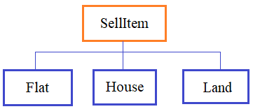

## Функция super() и делегирование.


**Подвиг 3.** (task_1.py)

Ранее вы уже использовали делегирование методов, когда вызывали инициализатор базового класса через функцию super(). Чаще всего делегирование в Python связано с вызовом магических методов базовых классов (так как их имена нельзя менять). Выполним такой пример.

Объявите в программе базовый класс с именем Book, объекты которого создаются командой:

    book = Book(title, author, pages, year)

где *title* - заголовок книги (строка); *author* - автор книги (строка); *pages* - число страниц (целое число); *year* - год издания (целое число). В каждом объекте класса Book должны формироваться соответствующие локальные атрибуты: title, author, pages, year.

Объявите дочерний класс DigitBook от класса Book, объекты которого создаются командой:

    db = DigitBook(title, author, pages, year, size, frm)

где дополнительные параметры *size* - размер книги в байтах (целое число); *frm* - формат книги (строка: 'pdf', 'doc', 'fb2', 'txt'). В каждом объекте класса DigitBook должны формироваться соответствующие локальные атрибуты: title, author, pages, year, size, frm.

Инициализация локальных атрибутов title, author, pages, year должна выполняться в базовом классе Book, а параметры size, frm инициализируются в дочернем классе DigitBook.

P.S. В программе нужно объявить только классы. На экран выводить ничего не нужно.

---

**Подвиг 4.** (task_2.py)

Создается программа по учету склада. Каждый предмет на складе должен описываться базовым классом Thing. Объекты этого класса создаются командой:

    th1 = Thing(name, weight)

где *name* - наименование предмета (строка); *weight* - вес предмета (вещественное число).

Для описания каждого конкретного вида предметов, создаются дочерние классы (на основе базового Thing):

ArtObject - для представления арт-объектов;\
Computer - для системных блоков компьютеров;\
Auto - для автомобилей.

Объекты этих классов создаются командами:
```python
obj = ArtObject(name, weight, author, date)  # author - автор (строка); date - дата создания (строка)
obj = Computer(name, weight, memory, cpu)    # memory - размер памяти (целое число); cpu - тип процессора (строка)
obj = Auto(name, weight, dims)               # dims - габариты, кортеж (width, length, height) - вещественные или целые числа
```
На основе класса Auto создаются дочерние классы Mercedes и Toyota, объекты которых определяются командами:
```python
auto = Mercedes(name, weight, dims, model, old) # model - модель (строка); old - время использования, в годах (целое число)
auto = Toyota(name, weight, dims, model, wheel) # model - модель (строка); wheel - тип руля: True - леворульный, False - праворульный
```
Во всех объектах классов должны создаваться соответствующие локальные атрибуты: name, weight и т.д.

Инициализация атрибутов должна выполняться в соответствующих классах (не должно быть дублирования кода).

P.S. В программе нужно объявить только классы. На экран выводить ничего не нужно.

---

**Подвиг 5.** (task_3.py)

Вам поручено организовать представление объектов для продажи в риэлтерских агентствах. Для этого в программе нужно объявить базовый класс SellItem, объекты которого создаются командой:

    item = SellItem(name, price)

где *name* - название объекта продажи (строка); *price* - цена продажи (число: целое или вещественное).

Каждые конкретные типы объектов описываются следующими классами, унаследованные от базового SellItem:

House - дома;\
Flat - квартиры;\
Land - земельные участки.



Объекты этих классов создаются командами:
```python
house = House(name, price, material, square)
flat = Flat(name, price, size, rooms)
land = Land(name, price, square)
```
В каждом объекте этих классов должны формироваться соответствующие локальные атрибуты: name, price и т.д.

Формирование атрибутов name и price должно выполняться в инициализаторе базового класса.

Далее, объявить еще один класс с именем Agency, объекты которого создаются командой:

    ag = Agency(name)

где *name* - название агентства (строка). В классе Agency объявить следующие методы:

add_object(obj) - добавление нового объекта недвижимости для продажи (один из объектов классов: House, Flat, Land);\
remove_object(obj) - удаление объекта obj из списка объектов для продажи;\
get_objects() - возвращает список из всех объектов для продажи.

Пример использования классов (эти строчки в программе не писать):
```python
ag = Agency("Рога и копыта")
ag.add_object(Flat("квартира, 3к", 10000000, 121.5, 3))
ag.add_object(Flat("квартира, 2к", 8000000, 74.5, 2))
ag.add_object(Flat("квартира, 1к", 4000000, 54, 1))
ag.add_object(House("дом, крипичный", price=35000000, material="кирпич", square=186.5))
ag.add_object(Land("участок под застройку", 3000000, 6.74))
for obj in ag.get_objects():
    print(obj.name)

lst_houses = [x for x in ag.get_objects() if isinstance(x, House)] # выделение списка домов
```
P.S. В программе нужно объявить только классы. На экран выводить ничего не нужно.

---

**Подвиг 6 (на повторение).** (task_4.py)

Ваша команда создает небольшой фреймворк для веб-сервера. Для этого был объявлен класс:
```python
class Router:
    app = {}

    @classmethod
    def get(cls, path):
        return cls.app.get(path)

    @classmethod
    def add_callback(cls, path, func):
        cls.app[path] = func
```
И его предполагается использовать следующим образом:
```python
@Callback('/', Router)
def index():
    return '<h1>Главная</h1>'


route = Router.get('/')
if route:
    ret = route()
    print(ret)
```
Здесь *Callback* - это класс-декоратор с параметрами: **path** = '/' - маршрут; **router_cls** = Router - класс роутера. Декоратор Callback должен обеспечивать добавление функции (в примере index) в словарь app класса Router. Ключом словаря выступает маршрут (path), а значением - ссылка на декорируемую функцию. Для этого следует использовать метод add_callback класса Router.

Затем, из роутера (Router) методом get выбирается ранее добавленная функция (в примере index), и если она существует, то вызывается с выводом результата в консоль.

Ваша задача реализовать класс-декоратор Callback.

**Небольшая справка.**

Для реализации декоратора с параметрами на уровне класса в инициализаторе \_\_init__(self, methods) прописываем параметр для декоратора, а магический метод \_\_call__() объявляем для декорирования функции:
```python
class Handler:
    def __init__(self, path, route_cls):
        # здесь нужные строчки

    def __call__(self, func):
        # здесь строчки
```
P.S. В программе нужно объявить только классы. На экран выводить ничего не нужно.

---

**Подвиг 7.** (task_5.py)

В программе объявлена функция integer_params для класса Vector, которая применяет к каждому методу класса декоратор **integer_params_decorated**:
```python
def integer_params(cls):
    methods = {k: v for k, v in cls.__dict__.items() if callable(v)}
    for k, v in methods.items():
        setattr(cls, k, integer_params_decorated(v))

    return cls


@integer_params
class Vector:
    def __init__(self, *args):
        self.__coords = list(args)

    def __getitem__(self, item):
        return self.__coords[item]

    def __setitem__(self, key, value):
        self.__coords[key] = value

    def set_coords(self, *coords, reverse=False):
        c = list(coords)
        self.__coords = c if not reverse else c[::-1]
```
Декоратор **integer_params_decorated** должен проверять, чтобы все передаваемые аргументы в методы класса (кроме первого self) были целыми числами (имели тип int). Если это не так, то должно генерироваться исключение командой:

    raise TypeError("аргументы должны быть целыми числами")

Ваша задача объявить эту функцию-декоратор.

Пример использования класса (эти строчки в программе не писать):
```python
vector = Vector(1, 2)
print(vector[1])
vector[1] = 20.4 # TypeError
```
P.S. В программе нужно объявить только класс. На экран выводить ничего не нужно.

---

**Подвиг 8 (на повторение).** (task_6.py)

Объявите класс SoftList, который наследуется от стандартного класса list. В классе SoftList следует объявить необходимые магические методы так, чтобы при обращении к несуществующему элементу (по индексу) возвращалось значение False (а не исключение Out of Range). Например:
```python
sl = SoftList("python")
sl[0] # 'p'
sl[-1] # 'n'
sl[6] # False
sl[-7] # False
```
P.S. В программе нужно объявить только класс. На экран выводить ничего не нужно.

---

**Подвиг 9 (на повторение).** (task_7.py)

Объявите класс StringDigit, который наследуется от стандартного класса str. Объекты класса StringDigit должны создаваться командой:

    sd = StringDigit(string)

где *string* - строка из цифр (например, "12455752345950"). Если в строке string окажется хотя бы один не цифровой символ, то генерировать исключение командой:

    raise ValueError("в строке должны быть только цифры")

Также в классе StringDigit нужно переопределить оператор + (конкатенации строк) так, чтобы операции:
```python
sd = sd + "123"
sd = "123" + sd
```
создавали новые объекты класса StringDigit (а не класса str). Если же при соединении строк появляется не цифровой символ, то генерировать исключение:

    raise ValueError("в строке должны быть только цифры")

Пример использования класса (эти строчки в программе не писать):
```python
sd = StringDigit("123")
print(sd)       # 123
sd = sd + "456" # StringDigit: 123456
sd = "789" + sd # StringDigit: 789123456
sd = sd + "12f" # ValueError
```
P.S. В программе нужно объявить только класс. На экран выводить ничего не нужно.

---

**Подвиг 10 (на повторение).** (task_8.py)

Объявите базовый класс с именем ItemAttrs, который бы позволял обращаться к локальным атрибутам объектов дочерних классов по индексу. Для этого в классе ItemAttrs нужно переопределить следующие методы:

\_\_getitem__() - для получения значения атрибута по индексу;\
\_\_setitem__() - для изменения значения атрибута по индексу.

Объявите дочерний класс Point для представления координаты точки на плоскости. Объекты этого класса должны создаваться командой:

    pt = Point(x, y)

где x, y - целые или вещественные числа.

Пример использования классов (эти строчки в программе не писать):
```python
pt = Point(1, 2.5)
x = pt[0]   # 1
y = pt[1]   # 2.5
pt[0] = 10
```
P.S. В программе нужно объявить только классы. На экран выводить ничего не нужно.
