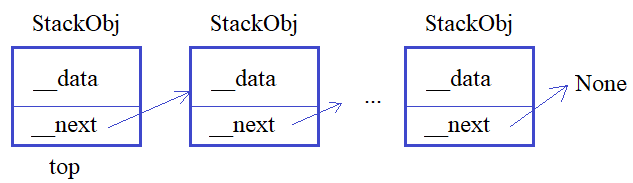

## Полиморфизм и абстрактные методы.
Текст песни: <https://proproprogs.ru/python_oop/python-polimorfizm-i-abstraktnye-metody>

---

**Подвиг 3.** (task_1.py)

В программе объявлены два класса:
```python
class Student:
    def __init__(self, fio, group):
        self._fio = fio  # ФИО студента (строка)
        self._group = group # группа (строка)
        self._lect_marks = []  # оценки за лекции
        self._house_marks = []  # оценки за домашние задания

    def add_lect_marks(self, mark):
        self._lect_marks.append(mark)

    def add_house_marks(self, mark):
        self._house_marks.append(mark)

    def __str__(self):
        return f"Студент {self._fio}: оценки на лекциях: {str(self._lect_marks)}; оценки за д/з: {str(self._house_marks)}"


class Mentor:
    def __init__(self, fio, subject):
        self._fio = fio
        self._subject = subject
```
Первый класс описывает студентов, а второй - менторов. Вам поручается на основе базового класса Mentor разработать еще два дочерних класса:

**Lector** - для описания лекторов;\
**Reviewer** - для описания экспертов.

Объекты этих классов должны создаваться командами:
```
lector = Lector(fio, subject)
reviewer = Reviewer(fio, subject)
```
где fio - ФИО (строка); subject - предмет (строка). Инициализации этих параметров (fio, subject) должна выполняться базовым классом Mentor.

В самих классах Lector и Reviewer необходимо объявить метод:

    def set_mark(self, student, mark): ...

для простановки оценки (mark) студенту (student). Причем, в классе Lector оценки добавляются в список _lect_marks объекта класса Student, а в классе Reviewer - в список _house_marks. Используйте для этого методы add_lect_marks() и add_house_marks() класса Student.

Также в классах Lector и Reviewer должен быть переопределен магический метод:

    __str__()

для формирования следующей информации об объектах:

- для объектов класса Lector: Лектор <ФИО>: предмет <предмет>
- для объектов класса Reviewer: Эксперт <ФИО>: предмет <предмет>

Пример использования классов (эти строчки в программе писать не нужно):
```python
lector = Lector("Балакирев С.М.", "Информатика")
reviewer = Reviewer("Гейтс Б.", "Информатика")
students = [Student("Иванов А.Б.", "ЭВМд-11"), Student("Гаврилов С.А.", "ЭВМд-11")]
persons = [lector, reviewer]
lector.set_mark(students[0], 4)
lector.set_mark(students[1], 2)
reviewer.set_mark(students[0], 5)
reviewer.set_mark(students[1], 3)
for p in persons + students:
    print(p)
# в консоли будет отображено:
# Лектор Балакирев С.М.: предмет Информатика
# Эксперт Гейтс Б.: предмет Информатика
# Студент Иванов А.Б.: оценки на лекциях: [4]; оценки за д/з: [5]
# Студент Гаврилов С.А.: оценки на лекциях: [2]; оценки за д/з: [3]
```
P.S. В программе требуется объявить только классы. На экран выводить ничего не нужно.

P.P.S. Подумайте, где в этой программе полиморфизм.

---

**Подвиг 4.** (task_2.py)

Вам необходимо объявить базовый класс ShopInterface с абстрактным методом:

    def get_id(self): ...

В самом методе должно генерироваться исключение командой:

    raise NotImplementedError('в классе не переопределен метод get_id')

Инициализатор в классе ShopInterface прописывать не нужно.

Далее объявите дочерний класс ShopItem (от базового класса ShopInterface), объекты которого создаются командой:

    item = ShopItem(name, weight, price)

где name - название товара (строка); weight - вес товара (любое положительное число); price - цена товара (любое положительное число).

В каждом объекте класса ShopItem должны формироваться локальные атрибуты с именами _name, _weight, _price и соответствующими значениями. Также в объектах класса ShopItem должен автоматически формироваться локальный приватный атрибут __id с уникальным (для каждого товара) целым значением.

В классе ShopItem необходимо переопределить метод get_id() базового класса так, чтобы он (метод) возвращал значение атрибута __id.

P.S. В программе требуется объявить только классы. На экран выводить ничего не нужно.

---

**Подвиг 5.** (task_3.py)

Ранее вы уже создавали классы валидации в виде иерархии базового класса Validator и дочерних:
```
StringValidator
IntegerValidator
FloatValidator
```
для валидации (проверки) корректности данных. Повторим этот функционал с некоторыми изменениями.

Итак, вначале нужно объявить базовый класс **Validator**, в котором должен отсутствовать инициализатор (магический метод \_\_init__) и объявлен метод со следующей сигнатурой:

    def _is_valid(self, data): ...

По идее, этот метод возвращает булево значение True, если данные (data) корректны с точки зрения валидатора, и False - в противном случае. Но в базовом классе Validator он должен генерировать исключение командой:

    raise NotImplementedError('в классе не переопределен метод _is_valid')

Затем, нужно объявить дочерний класс FloatValidator для валидации вещественных чисел. Объекты этого класса создаются командой:

    float_validator = FloatValidator(min_value, max_value)

где min_value - минимально допустимое значение; max_value - максимально допустимое значение.

Пользоваться объектами класса FloatValidator предполагается следующим образом:

    res = float_validator(value)

где value - проверяемое значение (должно быть вещественным и находиться в диапазоне [min_value; max_value]). Данный валидатор должен возвращать True, если значение value проходит проверку, и False - в противном случае.

Пример использования классов (эти строчки писать не нужно):
```python
float_validator = FloatValidator(0, 10.5)
res_1 = float_validator(1)  # False (целое число, а не вещественное)
res_2 = float_validator(1.0)  # True
res_3 = float_validator(-1.0)  # False (выход за диапазон [0; 10.5])
```
P.S. В программе требуется объявить только классы. На экран выводить ничего не нужно.

---

**Подвиг 6 (про модуль abc).** (task_4.py)

В языке Python есть еще один распространенный способ объявления абстрактных методов класса через декоратор abstractmethod модуля abc:
```python
from abc import ABC, abstractmethod
```
Чтобы корректно работал декоратор abstractmethod сам класс должен наследоваться от базового класса ABC. Например, так:
```python
class Transport(ABC):
    @abstractmethod
    def go(self):
        """Метод для перемещения транспортного средства"""

    @classmethod
    @abstractmethod
    def abstract_class_method(cls):
        """Абстрактный метод класса"""
```
Мы здесь имеем два абстрактных метода внутри класса Transport, причем, первый метод go() - это обычный метод, а второй abstract_class_method() - это абстрактный метод уровня класса. Обратите внимание на порядок использования декораторов classmethod и abstractmethod. Они должны быть записаны именно в такой последовательности.

Теперь, если объявить какой-либо дочерний класс, например:
```python
class Bus(Transport):
    def __init__(self, model, speed):
        self._model = model
        self._speed = speed

    def go(self):
        print("bus go")

    @classmethod
    def abstract_class_method(cls):
        pass
```
То в нем обязательно нужно переопределить абстрактные методы go и abstract_class_method класса Transport. Иначе, объект класса Bus не будет создан (возникнет исключение TypeError).

Используя эту информацию, объявите базовый класс **Model** (модель), в котором нужно объявить один абстрактный метод с сигнатурой:

    def get_pk(self): ...

и один обычный метод:

    def get_info(self): ...

который бы возвращал строку "Базовый класс Model".

На основе класса Model объявите дочерний класс ModelForm, объекты которого создаются командой:

    form = ModelForm(login, password)

где *login* - заголовок перед полем ввода логина (строка); *password* - заголовок перед полем ввода пароля (строка). В каждом объекте класса ModelForm должны формироваться локальные атрибуты с именами _login и _password, а также автоматически появляться локальный атрибут _id с уникальным целочисленным значением для каждого объекта класса ModelForm.

В классе ModelForm переопределите метод:

    def get_pk(self): ...

который должен возвращать значение атрибута _id.

Пример использования классов (эти строчки в программе писать не нужно):
```python
form = ModelForm("Логин", "Пароль")
print(form.get_pk())
```
P.S. В программе требуется объявить только классы. На экран выводить ничего не нужно.

---

**Подвиг 7.** (task_5.py)

Используя информацию о модуле abc из предыдущего подвига 6, объявите базовый класс с именем StackInterface со следующими абстрактными методами:

def push_back(self, obj) - добавление объекта в конец стека;\
def pop_back(self) - удаление последнего объекта из стека.



На основе этого класса объявите дочерний класс с именем Stack. Объекты этого класса должны создаваться командой:

    st = Stack()

и в каждом объекте этого класса должен формироваться локальный атрибут:

_top - ссылка на первый объект стека (для пустого стека _top = None).

В самом классе Stack переопределить абстрактные методы базового класса:

def push_back(self, obj) - добавление объекта в конец стека;\
def pop_back(self) - удаление последнего объекта из стека.

Сами объекты стека должны определяться классом StackObj и создаваться командой:

    obj = StackObj(data)

где data - информация, хранящаяся в объекте (строка). В каждом объекте класса StackObj должны автоматически формироваться атрибуты:

_data - информация, хранящаяся в объекте (строка);\
_next - ссылка на следующий объект стека (если следующий отсутствует, то _next = None).

Пример использования классов (эти строчки в программе писать не нужно):
```python
st = Stack()
st.push_back(StackObj("obj 1"))
obj = StackObj("obj 2")
st.push_back(obj)
del_obj = st.pop_back() # del_obj - ссылка на удаленный объект (если объектов не было, то del_obj = None)
```
P.S. В программе требуется объявить только классы. На экран выводить ничего не нужно.

---

**Подвиг 8.** (task_6.py)

С помощью модуля abc можно определять не только абстрактные методы, но и абстрактные объекты-свойства (property). Делается это следующим образом:
```python
from abc import ABC, abstractmethod


class Transport(ABC):
    @abstractmethod
    def go(self):
        """Метод для перемещения транспортного средства"""

    @property
    @abstractmethod
    def speed(self):
        """Абстрактный объект-свойство"""
```
Используя эту информацию и информацию о модуле abc из подвига 6, объявите базовый класс с именем **CountryInterface** со следующими абстрактными методами и свойствами:

name - абстрактное свойство (property), название страны (строка);\
population - абстрактное свойство (property), численность населения (целое положительное число);\
square - абстрактное свойство (property), площадь страны (положительное число);

*get_info()* - абстрактный метод для получения сводной информации о стране.

На основе класса CountryInterface объявите дочерний класс Country, объекты которого создаются командой:

    country = Country(name, population, square)

В самом классе Country должны быть переопределены следующие свойства и методы базового класса:

name - свойство (property) для считывания названия страны (строка);\
population - свойство (property) для записи и считывания численности населения (целое положительное число);\
square - свойство (property) для записи и считывания площади страны (положительное число);

get_info() - метод для получения сводной информации о стране в виде строки:

    "<название>: <площадь>, <численность населения>"

Пример использования классов (эти строчки в программе писать не нужно):
```python
country = Country("Россия", 140000000, 324005489.55)
name = country.name
pop = country.population
country.population = 150000000
country.square = 354005483.0
print(country.get_info()) # Россия: 354005483.0, 150000000
```
P.S. В программе требуется объявить только классы. На экран выводить ничего не нужно.

---

**Подвиг 9 (на повторение).** (task_7.py)

Вам поручают разработать класс для представления маршрутов в навигаторе. Для этого требуется объявить класс с именем Track, объекты которого могут создаваться командами:
```python
tr = Track(start_x, start_y)
tr = Track(pt1, pt2, ..., ptN)
```
где start_x, start_y - начальная координата маршрута (произвольные числа); pt1, pt2, ..., ptN - набор из произвольного числа точек (координат) маршрута (объекты класса PointTrack).

При передаче аргументов (start_x, start_y) координата должна представляться первым объектом класса PointTrack. Наборы всех точек (объектов PointTrack) должны сохраняться в локальном приватном атрибуте объекта класса Track:

__points - список из точек (координат) маршрута.

Далее, каждая точка (координата) должна определяться классом PointTrack, объекты которого создаются командой:

    pt = PointTrack(x, y)

где x, y - числа (целые или вещественные). Если передается другой тип данных, то должно генерироваться исключение командой:

    raise TypeError('координаты должны быть числами')

В классе PointTrack переопределите магический метод __str__, чтобы информация об объекте класса возвращалась в виде строки:

    "PointTrack: <x>, <y>"

Например:
```python
pt = PointTrack(1, 2)
print(pt) # PointTrack: 1, 2
```
В самом классе Track должно быть свойство (property) с именем:

points - для получения кортежа из точек маршрута.

Также в классе Track должны быть методы:

def add_back(self, pt) - добавление новой точки в конец маршрута (pt - объект класса PointTrack);\
def add_front(self, pt) - добавление новой точки в начало маршрута (pt - объект класса PointTrack);\
def pop_back(self) - удаление последней точки из маршрута;\
def pop_front(self) - удаление первой точки из маршрута.

Пример использования классов (эти строчки в программе писать не нужно):
```python
tr = Track(PointTrack(0, 0), PointTrack(1.2, -0.5), PointTrack(2.4, -1.5))
tr.add_back(PointTrack(1.4, 0))
tr.pop_front()
for pt in tr.points:
    print(pt)
```
P.S. В программе требуется объявить только классы. На экран выводить ничего не нужно.

---

**Подвиг 10 (на повторение, релакс).** (task_8.py)

Объявите класс с именем Food (еда), объекты которого создаются командой:

    food = Food(name, weight, calories)

где name - название продукта (строка); weight - вес продукта (любое положительное число); calories - калорийная ценность продукта (целое положительное число).

Объявите следующие дочерние классы с именами:
```
BreadFood - хлеб;
SoupFood - суп;
FishFood - рыба.
```
Объекты этих классов должны создаваться командами:
```python
bf = BreadFood(name, weight, calories, white) # white - True для белого хлеба, False - для остальных
sf = SoupFood(name, weight, calories, dietary) # dietary - True для диетического супа, False - для других видов
ff = FishFood(name, weight, calories, fish) # fish - вид рыбы (семга, окунь, сардина и т.д.)
```
В каждом объекте этих дочерних классов должны формироваться соответствующие локальные атрибуты с именами:
```
BreadFood: _name, _weight, _calories, _white
SoupFood: _name, _weight, _calories, _dietary
FishFood: _name, _weight, _calories, _fish
```
Пример использования классов (эти строчки в программе писать не нужно):
```python
bf = BreadFood("Бородинский хлеб", 34.5, 512, False)
sf = SoupFood("Черепаший суп", 520, 890.5, False)
ff = FishFood("Консерва рыбная", 340, 1200, "семга")
```
P.S. В программе требуется объявить только классы. На экран выводить ничего не нужно.
