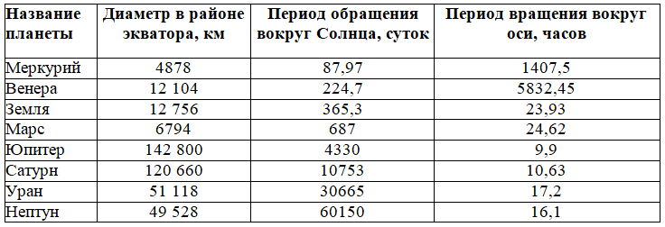

## Коллекция __slots__

---

**Подвиг 4.** (task_1.py)

Объявите класс Person, в объектах которого разрешены только локальные атрибуты с именами (ограничение задается через коллекцию \_\_slots__):

_fio - ФИО сотрудника (строка);\
_old - возраст сотрудника (целое положительное число);\
_job - занимаемая должность (строка).

Сами объекты должны создаваться командой:

    p = Person(fio, old, job)

Создайте несколько следующих объектов этого класса с информацией:
```
Суворов, 52, полководец
Рахманинов, 50, пианист, композитор
Балакирев, 34, программист и преподаватель
Пушкин, 32, поэт и писатель
```
Сохраните все эти объекты в виде списка с именем persons.

P.S. В программе следует объявить только класс и создать список. На экран выводить ничего не нужно.

---

**Подвиг 5.** (task_2.py)

Объявите класс Planet (планета), объекты которого создаются командой:

    p = Planet(name, diametr, period_solar, period)

где *name* - наименование планеты; *diametr* - диаметр планеты (любое положительное число); *period_solar* - период (время) обращения планеты вокруг Солнца (любое положительное число); *period* - период обращения планеты вокруг своей оси (любое положительное число).

В каждом объекте класса Planet должны формироваться локальные атрибуты с именами: _name, _diametr, _period_solar, _period и соответствующими значениями.


Затем, объявите класс с именем SolarSystem (солнечная система). В объектах этого класса должны быть допустимы, следующие локальные атрибуты (ограничение задается через коллекцию \_\_slots__):
```
_mercury - ссылка на планету Меркурий (объект класса Planet);
_venus - ссылка на планету Венера (объект класса Planet);
_earth - ссылка на планету Земля (объект класса Planet);
_mars - ссылка на планету Марс (объект класса Planet);
_jupiter - ссылка на планету Юпитер (объект класса Planet);
_saturn - ссылка на планету Сатурн (объект класса Planet);
_uranus - ссылка на планету Уран (объект класса Planet);
_neptune - ссылка на планету Нептун (объект класса Planet).
```
Объект класса SolarSystem должен создаваться командой:

    s_system = SolarSystem()

и быть только один (одновременно в программе два и более объектов класса SolarSystem недопустимо). Используйте для этого паттерн Singleton.

В момент создания объекта SolarSystem должны автоматически создаваться перечисленные локальные атрибуты и ссылаться на соответствующие объекты класса Planet со следующими данными по планетам:



Создайте в программе объект **s_system** класса SolarSystem.

P.S. В программе следует объявить только классы и создать объект s_system. На экран выводить ничего не нужно.

---

**Подвиг 6.** (task_3.py)

Объявите класс с именем Star (звезда), в объектах которого разрешены только локальные атрибуты с именами (ограничение задается через коллекцию \_\_slots__):
```
_name - название звезды (строка);
_massa - масса звезды (любое положительное число); часто измеряется в массах Солнца;
_temp - температура поверхности звезды в Кельвинах (любое положительное число).
```
Объекты этого класса должны создаваться командой:

    star = Star(name, massa, temp)

На основе класса Star объявите следующие дочерние классы:
```
WhiteDwarf - белый карлик;
YellowDwarf - желтый карлик;
RedGiant - красный гигант;
Pulsar - пульсар.
```
В каждом объекте этих классов должны быть разрешены (дополнительно к атрибутам базового класса Star) только следующие локальные атрибуты:
```
_type_star - название типа звезды (строка);
_radius - радиус звезды (любое положительное число); часто измеряется в радиусах Солнца.
```
Соответственно, объекты этих классов должны создаваться командой:

    star = Имя_дочернего_класса(name, massa, temp, type_star, radius)

Создайте в программе следующие объекты звезд:
```
RedGiant: Альдебаран; 5; 3600; красный гигант; 45
WhiteDwarf: Сириус А; 2,1; 9250; белый карлик; 2
WhiteDwarf: Сириус B; 1; 8200; белый карлик; 0,01
YellowDwarf: Солнце; 1; 6000; желтый карлик; 1
```
Все эти объекты сохраните в виде списка **stars**. Затем, с помощью функций isinstance() и filter() сформируйте новый список с именем **white_dwarfs**, состоящий только из белых карликов (WhiteDwarf).

P.S. В программе следует объявить только классы и создать списки. На экран выводить ничего не нужно.

---

**Подвиг 7.** (task_4.py)

Объявите класс Note (нота), объекты которого создаются командой:

    note = Note(name, ton)

где *name* - название ноты (допустимые значения: до, ре, ми, фа, соль, ля, си); *ton* - тональность ноты (целое число). Тональность (ton) принимает следующие целые значения:
```
-1 - бемоль (flat);
0 - обычная нота (normal);
1 - диез (sharp).
```
Если в названии (name) или тональности (ton) передаются недопустимые значения, то генерируется исключение командой:

    raise ValueError('недопустимое значение аргумента')

В каждом объекте класса Note должны формироваться локальные атрибуты с именами _name и _ton с соответствующими значениями.

Объявите класс с именем Notes, в объектах которого разрешены только локальные атрибуты с именами (ограничение задается через коллекцию __slots__):
```
_do - ссылка на ноту до (объект класса Note);
_re - ссылка на ноту ре (объект класса Note);
_mi - ссылка на ноту ми (объект класса Note);
_fa - ссылка на ноту фа (объект класса Note);
_solt - ссылка на ноту соль (объект класса Note);
_la - ссылка на ноту ля (объект класса Note);
_si - ссылка на ноту си (объект класса Note).
```
Объект класса Notes должен создаваться командой:

    notes = Notes()

и быть только один (одновременно в программе два и более объектов класса Notes недопустимо). Используйте для этого паттерн Singleton. 

В момент создания объекта Notes должны автоматически создаваться перечисленные локальные атрибуты и ссылаться на соответствующие объекты класса Note (тональность (ton) у всех нот изначально равна 0).

Обеспечить возможность обращения к нотам по индексам: 0 - до; 1 - ре; ... ; 6 - си. Например:
```
nota = notes[2]  # ссылка на ноту ми
notes[3]._ton = -1 # изменение тональности ноты фа
```
Если указывается недопустимый индекс (не целое число, или число, выходящее за интервал [0; 6]), то генерируется исключение командой:

    raise IndexError('недопустимый индекс')

Создайте в программе объект notes класса Notes.

P.S. В программе следует объявить только классы и создать объект *notes*. На экран выводить ничего не нужно.

---

**Подвиг 8 (на повторение).** (task_5.py)

В программе объявлен базовый класс Function (функция) следующим образом:
```python
class Function:
    def __init__(self):
        self._amplitude = 1.0     # амплитуда функции
        self._bias = 0.0          # смещение функции по оси Oy

    def __call__(self, x, *args, **kwargs):
        return self._amplitude * self._get_function(x) + self._bias

    def _get_function(self, x):
        raise NotImplementedError('метод _get_function должен быть переопределен в дочернем классе')

    def __add__(self, other):
        if type(other) not in (int, float):
            raise TypeError('смещение должно быть числом')

        obj = self.__class__(self)
        obj._bias = self._bias + other
        return obj
```
Здесь в инициализаторе создаются два локальных атрибута:
```
_amplitude - амплитуда функции;
_bias - смещение функции по оси ординат (Oy).
```
Далее, в методе \_\_call__() берется значение функции в точке x через метод _get_function(), который должен быть определен в дочерних классах, умножается на амплитуду функции и добавляется ее смещение. Следующий метод \_\_add__() позволяет менять смещение функции, изменяя атрибут _bias на указанное значение other.

Обратите внимание, в методе \_\_add__() происходит создание нового объекта командой:

    obj = self.__class__(self)

Здесь \_\_class__ - это ссылка на класс, к которому относится объект self. Благодаря этому в базовом классе можно создавать объекты соответствующих дочерних классов. В момент создания объекта ему передается параметр self как аргумент. Так будет создаваться копия объекта, т.е. новый объект с тем же набором и значениями локальных атрибутов.

Чтобы обеспечить этот функционал, объявите дочерний класс с именем **Linear** (линейная функция y = k*x + b), объекты которого должны создаваться командами:
```
obj = Linear(k, b)
linear = Linear(obj)  # этот вариант используется в базовом классе в методе __add__()
```
В первом случае происходит создание объекта линейной функции с параметрами k и b. Во втором - создание объекта со значениями параметров k и b, взятыми из объекта obj.

В каждом объекте класса Linear должны создаваться локальные атрибуты с именами \_k и \_b с соответствующими значениями.

В результате будет создан универсальный базовый класс Function для работы с произвольными функциями от одного аргумента.

Применять эти классы можно следующим образом (эти строчки в программе писать не нужно):
```python
f = Linear(1, 0.5)
f2 = f + 10   # изменение смещения (атрибут _bias)
y1 = f(0)     # 0.5
y2 = f2(0)    # 10.5
```
Пропишите в базовом классе Function еще один магический метод для изменения масштаба (амплитуды) функции, чтобы был доступен оператор умножения:
```python
f = Linear(1, 0.5)
f2 = f * 5    # изменение амплитуды (атрибут _amplitude)
y1 = f(0)     # 0.5
y2 = f2(0)    # 2.5
```
P.S. В программе следует объявить только классы. На экран выводить ничего не нужно.
 
